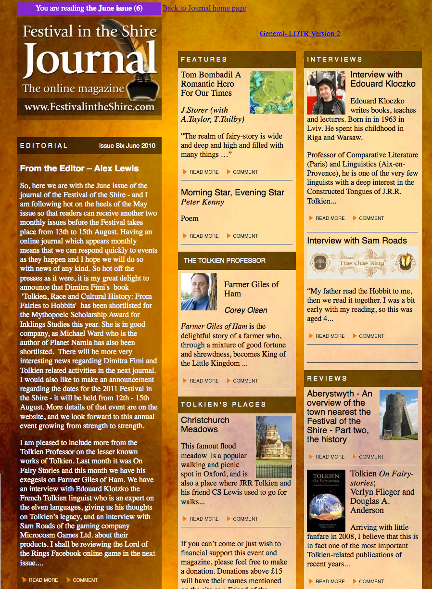

# A SEO COPY CHECK PAGE

*[image — role: featured | alt: Festival in the Shire Journal website front page | source: https://festivalartandbooks.com/wp-content/uploads/2020/06/journal-6-898x1200.jpg]*

## No1 Shop for Rare and Collectible Tolkien Books

Festival Art and Books (FAB) specialises in rare and collectible books by the world-renowned fantasy novelist, J.R.R Tolkien. We also sell an extensive selection of fantasy art inspired by Middle-earth and the rest of the ‘Secondary World’. Our Founder and Manging Director, Mark D. Faith is an expert in this realm with over 30 years’ experience as a collector. He is an avid fan of Tolkien and keen to share his knowledge with anyone who is serious about starting or expanding their collection. We even have 1st edition copies of The Lord of the Rings trilogy and The Hobbit for sale. If you would like to speak to Mark about the Items in our FAB shop email markfaith@festivalartandbooks.com.

## Buying and Selling with Festival Art and Books

You will save money by purchasing directly through our FAB shop. We offer you bespoke buying options too please contact us for more information You can also view our inventory on eBay and AbeBooks. Our inventory of rare and collectible Tolkien books and Middle-earth inspired art is one of the largest in the world and it is what we pride ourselves on. We do not use keywords disingenuously.

If you are looking for expert help selling all or part of your collection, we offer a consignment selling service upon request.

## More About Festival Art and Books

Our Founder, Mark D. Faith began selling his J.R.R Tolkien collection in 2001 under the company name Mark Faith Books. In 2010, following a festival he ran to bring together Tolkien inspired writers, artists and musicians from around the globe, the company name was changed to Festival Art and Books. In this case the word ‘Festival’ is referring to a celebration rather than an event. More information about the festival can be found under our resources section. If you have an idea for a J.R.R Tolkien inspired fan festival please email markfaith@festivalartandbooks.com. You can also find out more about Mark himself by viewing our contact and about us page.

Festival Art and Books, 28 Felindre, Pennal Machynlleth SY20 9DZ, UK

Click here if you don’t see what you are looking for!

---

## Links found on this page

- [FAB shop](https://shop.festivalartandbooks.com/)
- [markfaith@festivalartandbooks.com](mailto:markfaith@festivalartandbooks.com)
- [FAB shop](https://shop.festivalartandbooks.com/)
- [eBay](https://www.ebay.co.uk/str/festivalartandbooks)
- [AbeBooks](https://www.abebooks.co.uk/festival-art-and-books-aberdyfi/51881760/sf)
- [resources section](https://festivalartandbooks.com/festival-in-the-shire/)
- [markfaith@festivalartandbooks.com](mailto:markfaith@festivalartandbooks.com)
- [contact and about us page](https://festivalartandbooks.com/contact-and-about-us/)
- [Click here if you don’t see what you are looking for!](mailto:markfaith@festivalartandbooks.com)
