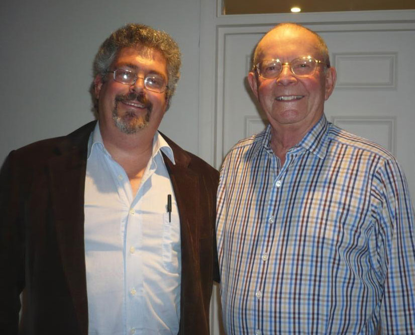
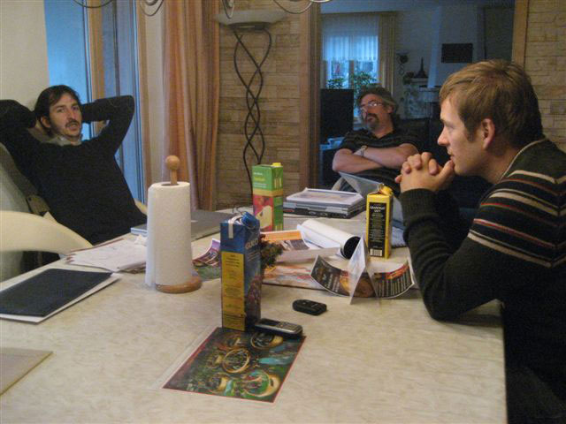
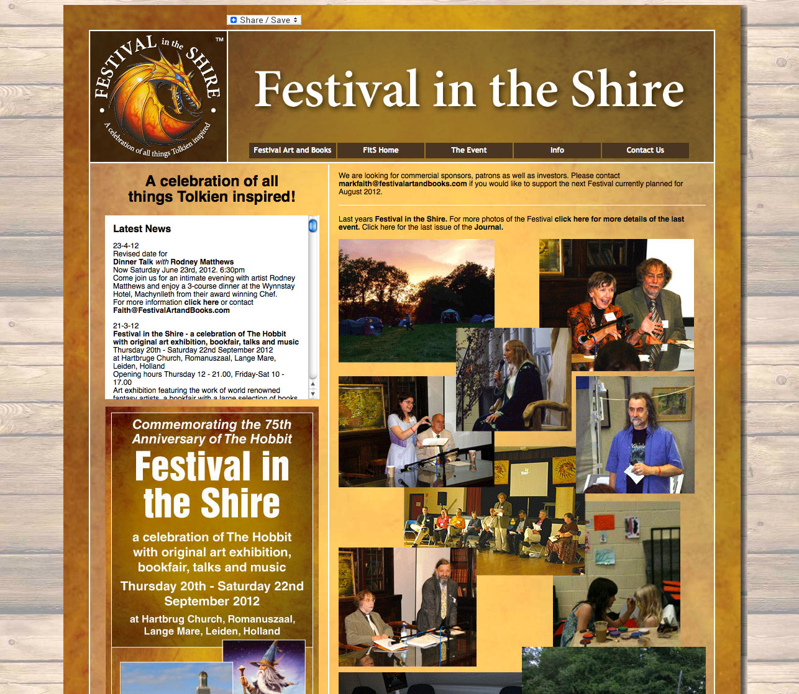

# CONTACT AND ABOUT US

*[image — role: featured | alt: Two smiling men standing indoors | source: https://festivalartandbooks.com/wp-content/uploads/2020/05/Mark-Faith-and-Wilbur-Smith.jpg]*

About Festival Art and Books

It is located near Machynlleth, Mid-Wales, U.K.  I travel a lot in the course of the business so it is best to reach us by email; I will call you back.  I sell and deliver books all over the world.

I started in the rare book dealing business as Mark Faith Books in January 2001. I had been a Tolkien collector for at least five years before that. I also sold Wilbur Smith first and signed editions for a short time.  Tolkien and Smith were my favourite authors.

eBay and the internet had a crucial impact on rare book dealing, and the market for all collectibles for that matter. Market globalisation revealed that many items which collectors thought to be rare were not so scarce after all. This reduced the prices which customers were willing to pay for such items while increasing the value of the truly rare. The information and specialised knowledge which gave dealers their main market advantage become transparent to all via the internet.

The downside of the internet then, and now, with the advent of AI, is information overload. The truth must be distilled from conventional wisdom, popular opinion, or outright fabrication. Many traditional dealers were caught out, unable to justify what they were charging for books shown by the internet to be more common than previously thought. While it was wonderful to have more choice and lower prices at their fingertips, customers now had to decide who they wished to do business as well as what to buy. This was a significant change to markets where once there were few specialist dealers holding the lion’s share of stock. The internet opened new doors and upset the established markets and key players.

New and old dealers were suddenly placed on an equal footing for a time, and both would have to rise to the new challenges the internet created. Many book dealers at the time had ‘bricks and mortar’ high street shops and did not survive the changes. Perceptive customers, then and now, felt that the internet ought to make things easier and faster for them and not just for the seller/dealer trying to increase profits. Dealers who understood this created an on-line as well as a physical high street presence,  enjoying the best of both worlds.

My path took a slight detour before I got to where I am today. I discovered that established collectors were having a difficult time adjusting to the market changes the internet brought. They still demanded personalised customer service and were not going to be fobbed off with some on-line gimmick, peddled by someone providing poor service. They asked me to find their rare books for them because they liked my great service. I consequently moved from general rare book dealing to specialised dealing, providing a bespoke sourcing and buying service for an ever-smaller circle of serious, dedicated collectors.

These customers would include private museums, institutions, celebrities, and wealthy individuals building collections of specific authors. The were seeking not just Tolkien books but also art and memorabilia.

In fact, only a small fraction of my business with regard to Wilbur Smith and Tolkien, particularly the latter, was conducted over the internet. Nonetheless I handled transactions worth millions of pounds sterling. During this period, whether they came onto the open market or were sold privately, the most important and rarest items passed through my business. This is how I became such an expert even though I was relatively new to the market. This included a signed Hobbit book, which sold for £54,000, and a Lord of the Rings set for £75,000, the highest prices ever achieved for these books up to that point. Now they seem cheap! I also handled many dozens of original art works and limited edition prints that were Tolkien inspired. This is how I know so many artists producing work inspired by Tolkien, who I still work with today.

*[image — caption: The founders of the Tolkien Museum in the early stages of talks | source: https://festivalartandbooks.com/wp-content/uploads/2020/05/True-frounders-of-GTC.jpg]*

In 2010 I proposed to create a festival: Festival in the Shire. This was both to create a major event for fans as well as a focus point for worldwide collectors of Tolkien books and Tolkien inspired art. Many famous artists and authors spoke at the event. Consequently I am now one of the largest and best recognised dealers of collectible Tolkien books and art in the world.

The Festival was designed to bring all facets of the Tolkien fan market together under one roof for one major event. While many film and book fans collect, serious collectors are fewer in number and I still provide bespoke services for those wishing to build a complete Tolkien collection without the hassle and without it taking all their free time. They let us do the work for them, sourcing and buying rare copies of books as well as art and other items.

*[image — source: https://festivalartandbooks.com/wp-content/uploads/2020/05/fabwebsite.jpg]*

Click here for the Festival in the Shire page

We continue to hold small exhibition and fan events, both for fans and serious collectors.

Mark Faith, Owner and Founder Festival Art and Books, Festival in the Shire

Contact Mark Faith on markfaith@festivalartandbooks.com for further information.

---

## Links found on this page

- [Click here for the Festival in the Shire page](https://festivalartandbooks.com/festival-in-the-shire/)
- [markfaith@festivalartandbooks.com](mailto:markfaith@festivalartandbooks.com)
