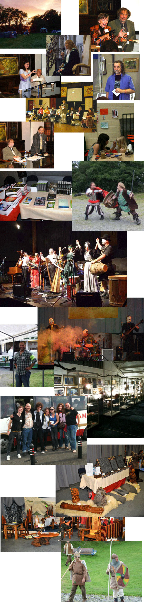

# FESTIVAL IN THE SHIRE

*[image — role: featured | alt: Collage of community events and performances | source: https://festivalartandbooks.com/wp-content/uploads/2020/05/Festival-photo-montage-591x1200.jpg]*

Festival in the Shire

One of the biggest Tolkien events in 2010 was Festival in the Shire.  With over 500 attendees and held over three days, there was a comprehensive cast of academic Tolkien academic experts giving lectures, with an art show, stalls, entertainment and fan exposition.  For three years after we held smaller local events including one in Scotland and another in the Netherlands. Later we did occasional book and art exhibitions.  This was not just about collecting Tolkien Rare Books, but a journey into the amazing writing and the author himself. Keep your eye on our website as we have plans to do these again.

Click here to see the Event website

Click here to view the Schedules

*[image — source: https://festivalartandbooks.com/wp-content/uploads/2020/05/Festival-photo-montage.jpg]*

---

## Links found on this page

- [Click here to see the Event website](https://festivalartandbooks.com/FAB/FitS/)
- [Click here to view the Schedules](https://festivalartandbooks.com/FAB/FitS/schedules.html)
