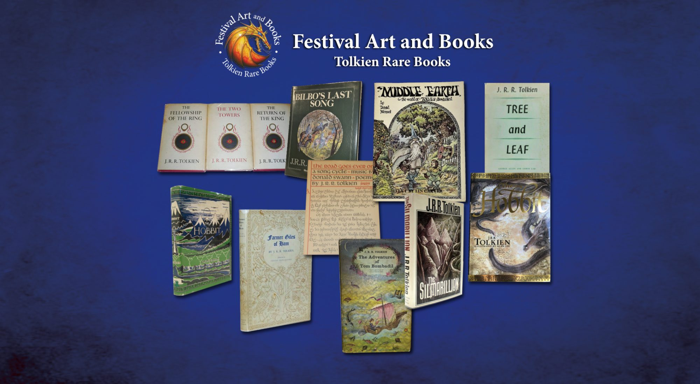

# FESTIVAL ART AND BOOKS

*[image — role: hero | alt: Festival Art and Books — Tolkien Rare Books homepage montage of first edition covers | source: https://festivalartandbooks.com/wp-content/uploads/2024/06/cropped-fab-home-page-montage-b.jpg]*

Welcome to our site and thank you for taking the time to visit!

I have specialised in selling rare Tolkien books for 25 years. Mine is one of the oldest and largest Tolkien rare book dealerships in the world. I am not a general book seller. Visit my eBay or Abebooks shop, read my feedback, and you will see that I always have the most rare Tolkien books in stock, available to buy, and none of the sold out stock or non-existent loss-leaders characteristic of so-called specialists. I feel that your time is important and recommend you buy the best from the best.  As a specialist I must get it right first time, every time or I would not have stayed in business for 25 years.

Did you know that Abebooks, a rare and out-of-print used book website is part of Amazon?  eBay comprises not just private sellers, but long established, branded business sellers with long established eBay shops just like ours.

I only sell J.R.R. Tolkien collectable books, not those of any other authors, and I have no other day job. I am recognised as the leading expert on rare Tolkien books, Tolkien collecting and investment. I also advise clients on strategy and timing. Click on our shop links below to see all our current inventory but contact me directly to purchase to avoid fees.

Tolkien scholars and general book dealers, even older ones, are not Tolkien rare book experts.  I have been selling rare and collectable Tolkien books for 25 years. I have sold some of the rarest and most expensive first editions ever and have always been the first to predict new price levels.  I know the market, having helped to create it as one of the pioneering dealers when the new films came out. I even set up a Tolkien museum in Switzerland.  I always have the most, and the best copies for sale at any given point.  Check our eBay and Abebooks shops. While you can find me with older news searches and via my Festival in the Shire, I do not use social media or pay for advertisements and so do not come top in search engine lists.  You will find me eventually!

New in 2026

The 26-page E-book ‘Tolkien Collectors Guide’  written by Mark Faith, owner of Festival Art and Books, is now available free via the resources tab.  The guide gives general advice on collecting Tolkien first editions and other rare and collectable Tolkien books. For specifics on what to buy and the best investment strategies, I offer free personal advice.

Subscribe to our free newsletter!

I send out a free newsletters on collecting JRR Tolkien rare books depending on the latest news and market developments.  The newsletters are more frequent during Autumn and Spring, the busier buying periods. Of course you can contact us directly with any questions at any time.  We serve the collecting community.

Email: MarkFaith@festivalartandbooks.com

With record prices being achieved by Tolkien first editions, it is more important than ever to have accurate and truthful advice. There is a lot of misinformation and ‘click bait’ on the internet. In the last five years we have noticed a huge decline in accuracy and quality in search engine and AI results on collecting Tolkien books.  This is likely due to the AI and huge changes in how search engines work.

I also have 25 years’ worth of previous customers looking to sell their rare Tolkien book collections to us on consignment.  If you do not see what you are looking for, please contact us and I will find it for you! Visit my shops frequently as my stock changes and new consignment items come in every week.

Our Inventory of rare books for sale

Items for sale are listed in in eBay and AbeBooks shops.  I am discovered on these sites as they have millions of new visits each month, but most of my sales are made directly by email/phone, saving unnecessary site taxes and fees. I can also meet up with you in person to show you my more expensive books.  I hand-deliver valuable books all over the world.  I have always had 100% positive feedback. As a specialist, I must get it right, every time, for every customer or I would be out of business by now. My time in the business guarantees my authenticity and reputation. If you see something you want for sale in my shops, contact me directly for the best price.

No. 1 Shop for Rare and Collectible Tolkien Books

Click here if you don’t see what you are looking for!

Sitemap

---

## Links found on this page

- [MarkFaith@festivalartandbooks.com](mailto:MarkFaith@festivalartandbooks.com)
- [eBay](https://www.ebay.co.uk/str/festivalartandbooks?_trksid=p2047675.l2563)
- [AbeBooks](https://www.abebooks.co.uk/festival-art-and-books-aberdyfi/51881760/sf)
- [Click here if you don’t see what you are looking for!](mailto:markfaith@festivalartandbooks.com)
- [Sitemap](https://festivalartandbooks.com/sitemap_index.xml)
