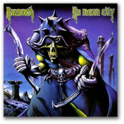

# NAZARETH

*[image — role: featured | alt: Hooded skeletal warrior with swords album cover | source: https://festivalartandbooks.com/wp-content/uploads/2020/05/nazereth.jpg]*

Press Release October 2014
Iconic British rock band Nazareth
Announce VIP gig/DVD launch:
14th November 2014

Entertainment One, in association with Metropolis Studios and Festival Art and Books, present The Rock Screen, a new series of Rock documentary & live DVD releases for 2015. The first of the bands to feature in the series is iconic British rock band Nazareth who are offering fans and media the chance to attend an exclusive intimate VIP gig that will also be filmed as part of the forthcoming documentary and live DVD release. Tickets can be bought here: www.musicglue.com/metropolis/events/14-nov-14-entertainment-one–metropolis-studios-present-the-legendary-rock-of-nazareth-metropolis-studios/

Nazareth started in the late 60’s/early 70’s and were pioneers of a distinctive and definitive rock ‘n ‘ roll sound which had a massive influence on many of the great rock bands that followed – most notably Axl Rose and Guns n Roses, who recorded a cover of ‘Hair of the Dog’ on ‘The Spaghetti Incident’ album.
Over the years the band has gone through a number of line-up changes, but Bassist Pete Agnew has remained constant throughout and will be performing at the intimate Metropolis Studios gig alongside his son Lee Agnew (Drums) and Jimmy Murrison (Guitars).
Also attending the gig and being interviewed for the documentary will be renowned artist Rodney Matthews who has designed the sleeve artwork for the forthcoming Nazareth DVD release. Rodney will be giving a talk on the day about his artwork and there will be an exhibition and sale of Rodney’s work at Metropolis studios for four weeks covering a range of his rock album covers, including his seminal artwork for Nazareth’s 1978 album ‘No Mean City’. The exhibition is open to the public December 2nd-5th, noon until 8 p.m. The exhibition is open all other times by appointment only. Attending the exhibition is also an opportunity to see one of the world’s most famous recording studios. Rodney will also be giving a talk about his art at the exhibition on Wednesday, December 6th at 7 p.m. Come join us for a drink. Please RSVP so we know the numbers.
–
Details of the Metropolis VIP Session / DVD launch, November 14th 2014:
For the Metropolis Session, 125 lucky fans will have the VIP experience of a lifetime and be able to see Nazareth perform some of their greatest hits up close. The show will be filmed and will form part of a ‘Rock Screen Presents’ DVD release due in March 2015, together with an exclusive documentary, so fans will get to be part of this unique experience. FOR FURTHER INFORMATION AND TICKETS CONTACT: MarkFaith@festivalartandbooks.com

---

## Links found on this page

- [MarkFaith@festivalartandbooks.com](mailto:MarkFaith@festivalartandbooks.com)
