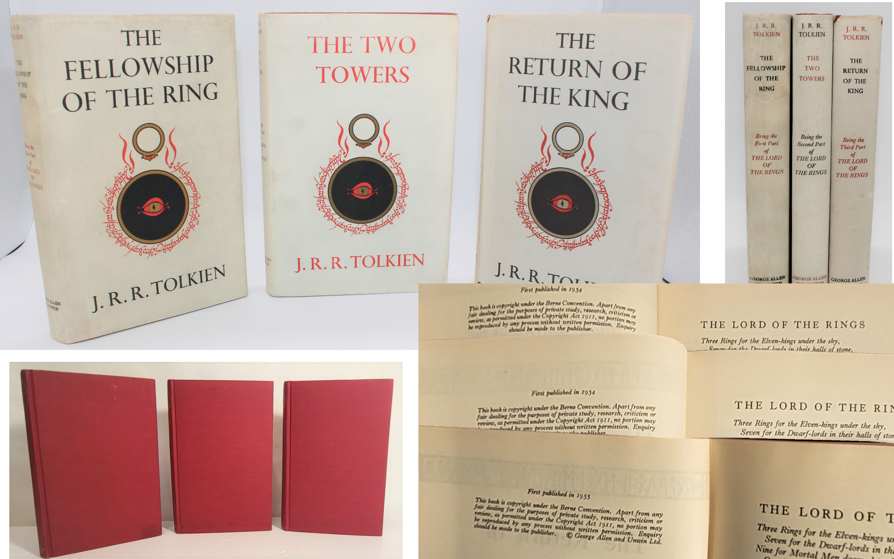
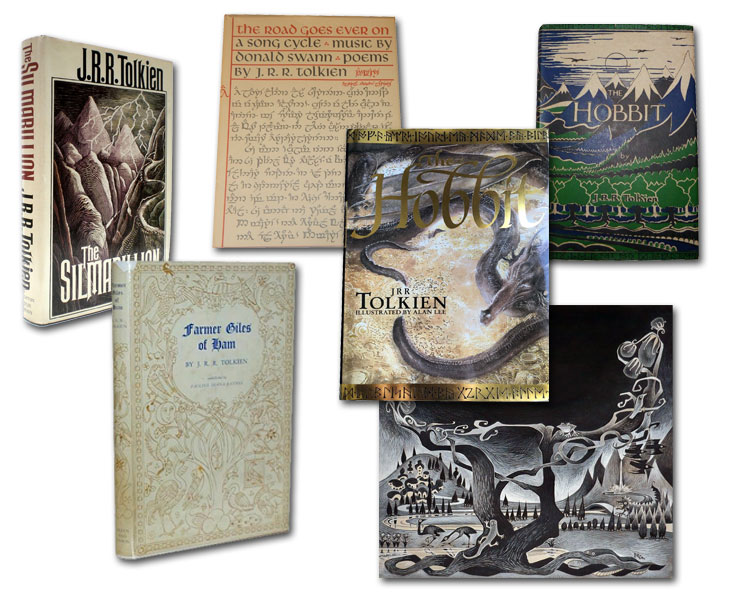
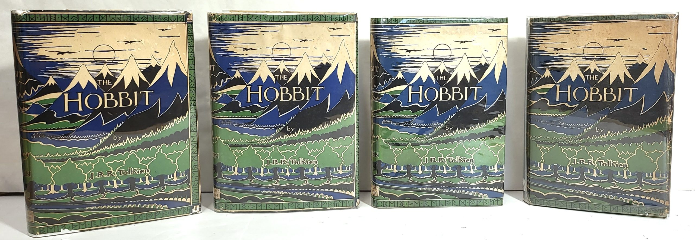

# RARE TOLKIEN BOOKS & COLLECTABLES

*[image — role: featured | alt: Four vintage editions of The Hobbit | source: https://festivalartandbooks.com/wp-content/uploads/2024/08/first-four-hob-2000x1109.jpg]*

*[image — source: https://festivalartandbooks.com/wp-content/uploads/2024/08/tolkien-mointage-2.jpg]*

Rare Tolkien books’ mostly refers to first and early printings of the very first printings ever available to the public.  They have never been out of print and have since been printed in many new editions over the decades. A collection can be hundreds or even a thousand books plus posters and other memorabilia.   While newer editions can be collectable, especially deluxe editions with smaller print runs, the are not that expensive to buy.  Tolkien book collecting is now so popular that any edition, in any language is collected somewhere all over the world, not just in the English speaking world. The most popular titles to collect are The Hobbit and The Lord of the Rings and the hundreds of printings and new edition of just these titles.

Collecting Tolkien Books for Fun and Investment

by Mark Faith

Collecting Tolkien rare books is a tale of modern, not antiquarian book collecting. Novice sellers’ and buyers’ mistakes notwithstanding, collecting Tolkien books is an enjoyable hobby with very few pitfalls. Though there are only a handful of titles, there are hundreds of editions and printings that range from £10 to £500,000 or even more, something for every budget.  Most are easy to identify, and the prices generally reflect what you are going to get for your money.  If it sounds too good to be true, it is.

While there was in the not so distant past still the remote chance of a Tolkien  treasure being found in grandmother’s attic or a local charity shop, this doesn’t happen much anymore. The general public are aware that early editions are valuable and do not give them away without doing a bit of research first.  You do have to take the time to teach yourself the very basics, which is part of the pleasure.  Dealers will help, to a degree, if you are buying from them, but they are busy and cannot be called upon to answer every little question you could have researched yourself.  I publish some guides on my website, and you can subscribe to our collector’s newsletter at no cost.  Where you really need the advice of a specialist dealer is when spending thousands on a book.

The main lesson to learn is that condition is everything in Tolkien books, and all modern collectable books for that matter. The older the printing,  and the closer it is to the first printing, the more valuable it will be. Any printing must, however, be complete with the dust jacket and have no damage beyond normal wear and tear. Generally, they have to have been printed by the original publishers and not be a cheap book club edition.  The same book of the same printing can be worth £50 or £5,000, it varies entirely according to condition.  There are plenty of worn books; it is the fine ones that are truly rare. Every day someone says to me that they have a special old book, but then I learn that it is damaged, missing its jacket, or the jacket is severely damaged. Sadly, it is likely to be worthless, while the same book complete, and in near fine condition would be very valuable.  As time goes on, however, even poor copies can rise in value as the best become unaffordable for the collector of average means.  Tolkien book collecting caters to all fans’ budgets.

A lesson which has become crucial in the internet age is that you have to assess the supply and demand at any given moment in time. If there are no other similar copies for sale, you will have to pay a lot more; if there are plenty of copies, you will pay much less. This can change month by month, year by year.  The long-term trend in Tolkien is steadily upward. I have never seen prices fall.  In the last two years copies published prior to 2000 are the scarcest and most are in poor condition.  It pays to shop around and compare dealers if you can, but it’s less time consuming and risky to buy from a specialist dealer who has a good reputation to protect.  General dealers who are not specialists can be inconsistent in both quality and price.  Auctions are the worse place to buy; one day you get a bargain, the next you overpay.  Auction prices are not indicative of values and trends except over long periods of time.

When it comes to prices, common sense sometimes goes out of the window. Shopping for collectables based on low price alone is as silly as paying too much.  You get what you pay for, and the old adage that something is only worth what someone will pay holds true.  A rare book, like a house, may be worth £200,000, but you have to find someone who will actually pay for it and believes you when you say it is worth that much. This is where specialists with long-established reputations come in.  If you commission a specialist Tolkien dealer to sell your book, you are paying them for their access to their market and relying on their reputation to guarantee quality and support price they are asking.  People call me all the time and ask me something’s retail value, even at the lower end of the market.  I will say, for example, “roughly £500”, but later they’ll tell me they could not sell it for that. This is because only a specialist with a good reputation has credibility. If you buy from a specialist, you will generally get what you pay for, though not necessarily a bargain. If there is a problem later, you have recourse with a professional.  Anything of real value that you can get at a bargain price is a near impossible find, but you can get lucky. If you do find a good one, buy it while you can.

Informed collecting, with the intention of making a gain, is investment. It requires experience and management of risk, not luck or a gamble. If you cannot afford to spend the time or lose the money, do not do it. If you do not have time to educate yourself, then buy from a specialist dealer. Yes, there is always a speculative element to investing, but rarely do items of true intrinsic value lose their value completely, unless they are in a highly specialised field like art or subject to speculators manipulating the market.  Tolkien books are great literature and have lasted the test of time as each new generation discovers his work.  This cannot be said for many authors who tend to be generational favourites.  The best thing you can get from collecting is enjoyment of something you can develop a passion for.  Do not choose something just because it makes money, but because it is of interest to you in some way.  In this way, in the worst cases, you can enjoy the books even if they do not make lots of money.

About Impressions and Hardback Dust Jacket Wear

Impressions are the same as printings, terms derived from the old technology of printing presses making an impression on paper. Everything is now digital and modern first printing books traditionally have a ‘1’ in the number line to denote the first edition. This has changed in the last decade, books now being printed in one country and assembled in another.  There are now big variations between publishers as far as first printings are concerned. First editions, however, are not the same thing, being determined by the first publisher and country of origin. Text changes can now be made mid-print run by computer, whereas older books required re-setting of the press. The printing of newer books can be considered print runs, which, when they sell out, can be duplicated at the push of a button. The ‘1’ is removed in the next print run, ‘2’ becoming the lowest number in the number line on the copyright page. This can now happen before the number 1 run is even released to bookstores.  If there have been new printings, 10 numbers will still appear in the number line as subsequent numbers are added: 11, 12, etc. American publishers used the number line system before their U.K. counterparts.

Older books show the edition by year and by printing.  A first edition, first printing will be referred to as a 1st/1st, for example. The next printing would be a 1st/2nd and so on.

An important note about ISBN numbers: they are useless to book collectors! The number applies to the original registration of that particular publication, not necessarily the first edition of that book; the same ISBN number may be used for variations like deluxe editions or changes of cover art or artist. For example, there are many variations of the 1966 Hobbit using the same ISBN.  Publishers also created slip-cased sets, as they did with the first Lord of the Rings sets. Different impressions and ISBNs can be mixed together in a new case.

The original three Lord of the Rings books were printed separately, and as stocks ran out, they printed more. Both books and dust jackets can be mismatched impressions, and the latter were commonly re-used. Paper and the printing process were expensive; spare dust jackets were not wasted back then.

There are some lasting records from the printers from the mid-1950s, but not distribution records from the publisher Allen & Unwin. Bookstores could have made their own changes, matching old inventory with new. After all, how often do you check the printing of a brand-new book bought today? A Lord of the Rings set was whichever three happened to be together in a certain bookstore, and would not necessarily be matched in terms of the year of the edition or the printing.  Given the expense, fans probably often bought just one book at a time when they could afford it, making their sets’ years and impressions even more varied. Some years had two printings. There are probable combinations of impressions in sets based on print runs from a certain year.  As a dealer I have seen hundreds of sets and recognise familiar groupings, but any combination is possible.  Incidentally a later printing of Return of the King would not have been combined with earlier impressions of the other two titles; the latest impression in a set is always Fellowship of the Ring.  Where you see this, a collector has compiled the set.

It was never possible to buy a set of first edition, first printings. By the time, the 1st Return of the King came out, the 1st Fellowship of the Ring had sold out, though one or two could still be found in bookstores with luck.  A collector could deliberately seek out first editions and put a set together. The slipcase was introduced by the publisher to encourage the purchase of sets, but these were very expensive even into the 1960’s. There are American and other foreign editions, but these are not as collectable as the British ones even though America had a bigger readership for Tolkien books. British editions were released first and so are considered to be the true first editions.

Today, collectors want the earliest impressions of each title which could potentially have been available as a set, and jackets to match the impressions of the books, plus matching aging and wear. We have noticed serious collectors will pay much more for a uniformly aged set. Mismatched colour in the dust jackets simply does not look good on the bookshelf! I coined the phrase ‘uniform wear’ to mean all three jackets and books having similar colour, aging signs and paper wear so that they present well as a set on a shelf. This does not mean they were bought together, but that they were kept together long enough for the aging to be uniform.   The Fellowship of the Ring was read more often being the first book, so it is common to find the other two titles in much better condition but usually the colour is still uniform.

Because hardbacks were very expensive, the publishers used cheaper paper. Most of the dust jacket wear tends to be on the spine which was exposed to the air.  Back then, fewer people had central heating in Britain.  The common dampness in British homes led to mould, which in turned discoloured the dust jacket paper, especially the spine. This can range from complete deep brown to white spotting, to fading of the title colours.  The damp also caused bleed from the red cloth book covers to the back of the dust jackets. It also weakened the paper making the jacket spines subject to fraying and paper loss.  The rest of the jacket can often be found to be very nice; however, the original colour is grey, not beige, or white.  You can tell this by the grey flaps (fly-leaves) where the price and reviews appear.  The rarest sets I have ever sold had light grey dust jackets, which, by the second edition, were dark grey.

Discolouration is inevitable on sets today as shown by the photos posted in my listings, so the damage to the dustjackets’ paper by fraying or paper loss can make one set more valuable than another. No two dust jackets match in colour unless they have stayed together a long time. I have always shown photos of the dust jackets laid flat so that you can see the true condition; I hide nothing. Completeness of the jackets is very important to value.  You can think of this in terms of the percentage of paper loss, say 5% or 10%, which is usually on the spine ends from being pulled from a bookshelf. Whole sections of paper missing unfortunately reduce the value significantly.  Because sets are so expensive, some people have had the paper loss repaired on early sets especially spine ends or top edges and corners. Digitally printed facsimile dust jackets are being sold which are very cheap.  These add no value to a book set whatsoever compared to a set lacking its jackets. Do not be fooled by some sellers trying to overprice a less expensive jacket-less book with a fake jacket. This is more than just a deception; it is theft!

Tolkien Book Values

Before the internet the prices of rare books, not just Tolkien’s, were available to the public through dealer catalogues, auction results and some fan clubs. These were generally regional or national and buying a book from the other side of the globe was not common, except for the very valuable, museum standard copies. As information is inherently out of date as soon as it is printed, there could be a variety of prices for the very same book. Historically the most recent, highest selling price became the new benchmark. As regards very rare copies, however, so few came on to the market that values could be seen to jump or fall significantly since the last sale, months or years previously.

A dealer’s price would be “priced forward” based on price trends and to allow a discount.  The value was never real-time or fixed in stone, as with all rare collectibles. Prices of unique items are not set by fundamental laws of supply and demand but are speculative values.  These are established not just by greedy sellers, but mostly by keen buyers driving prices up. This applies to most markets, not just the book market. Prices rise because people are able and willing to spend more. How often do we hear in the property market that a buyer put in a higher offer? That is not the seller’s fault. Understanding rare book market prices is about understanding the market, especially for particular genres or authors. It takes time and experience for which there is no substitute except to pay others for their experience.

The internet changed two things in the world of books and collectibles. Firstly, one could now see the world-wide availability of items of a certain standard or with particular features. Secondly, one could see current asking prices. With a click of a button, the buyer could instantly see the quality and current price of a title, but also the seller could adjust their prices instantly. It created a “live” market.  This aspect has contributed to a move away from auctions and the reliability of prices at auction. I was asked some time ago by a major dealer “did I adjust my prices real time”? The answer was “of course, why not?”.  For a general rare book dealer with thousands of books in stock, it is not practical to adjust prices of individual titles weekly or daily. This has led to specialisation by dealers. The fundamental feature of any market in collectibles is that their value is only what someone will pay. Trying to determine the current value of a book is now harder than ever.

One of the things I noticed in earlier internet days, when one rare book came on the internet market, five more did at the same time! Suddenly sellers were competing and forcing their own values down due to over- supply, generally by inexperienced new or one-off sellers. Once this flood of copies sold, it was months or even years before the same book came on the market again, and then at a much higher price due to scarcity.  Knowing past market activity and supply is therefore as important as knowing current and predicted market values.

To err on the side of caution in a real time market, sellers ‘price forward’ their rare stock values more than ever to avoid selling too cheaply.  Why? Not because they are greedy but because to stay in business they have to pay more to supply the same book in an increasingly popular market, often competing with their own customers in a purchase.This means that for rare books in high demand, the current price is likely to be what they will be worth at some point in the future, demand and supply being consistent in the meantime. Markets in popular collectibles act more like commodity markets as regards price trends, both being volatile due to speculation, but also subject to fundamental forces. Both buyers and sellers can be caught out by the same uncertainty and unpredictability. Sometimes I get a bargain; sometimes I pay too much.  The ability to predict the market is more important than ever. However, knowing what you are buying is equally vital.

The internet has revealed that conventional wisdom about very rare books and their scarcity is not fact but simply knowledge that has become accepted because it came from a good source and has never been challenged. Most information on rare books is based on the printing technology or details provided by the publisher at the time. This is an aid to identifying true first editions but is not necessarily critical to value; it is interesting, but irrelevant. The publishers’ printed descriptions, whose trade terminology was unique to the printing of books at the time, are now redundant. Several good photos can tell you everything you need to know.

Tolkien books are straightforward in so far as publishing details are clearly printed in the books. Certain variations, characteristics, or mistakes are interesting, but irrelevant to value. The books are now so scarce that all variations are valuable. What is more critical is the condition, not necessarily the printing or variation.  An older printing in fine condition can be worth much more than an average early printing.  The dust jacket’s condition contributes most of the value of many contemporary books.  Interesting features and details, whether they are correct or not, are secondary to condition, especially that of the dustjacket. What is important when choosing a particular book and its price is knowledge of market factors, not old-school publishing and book details.

This price focus can be upsetting to traditional dealers, collectors or fans. The commercialisation and commodity value aspects of modern book collecting offend the sensibility of some people, as if it degrades the intrinsic value of the author and his works. I often hear: “that’s a ridiculous price you are charging, I bought mine for £25.00”.  The same could be said about current house prices. No new, younger buyer wants to hear about an old market and how clever you are for being born three decades sooner! It matters only what the price and condition are now and what is likely to happen in the future.

The truth about what people of all ages really want in books, or houses, is that they want the price to be low when they are buying, and then for it to shoot up soon after. They greedily want what earlier buyers got by accident but are too impatient to wait or put in the time required to buy correctly.  Book investment may seem like a get rich quick scheme based on temporary market trends, but for most people it takes time and luck in the long term.

What is a Lord of the Rings set?

Professor Tolkien’s now world-famous literary masterpiece “The Lord of the Rings” (LotR) was the long-awaited sequel to “The Hobbit”, released in 1937. It originally consisted of five books but was reduced to three to lower printing costs and make it more affordable. The war caused a considerable delay and the author’s search for perfection in his writing exacerbated this.  Even after the 1954 release of “The Fellowship of the Rings” (FotR) he continued to make text changes in the next fifteen first edition printings and on into the second printing of the second edition at which point he was more or less satisfied.

“Two Towers” (TT) and “The Return of the King” (RotK) were subject to the same printings and revisions, twelve and eleven impressions respectively. Hardback books were very expensive in the 1950s, so publishers limited print quantities until they knew the previous print run had sold out.  The three books were not sold as a set initially because of the cost. Customers bought them as they were released or as they could afford to. New books were printed as the old ones sold, which gave Tolkien the opportunity to make text changes and corrections for each print run. At the same time the “Hobbit” printings were being amended so that the stories and characters aligned. There are some records of sizes of print runs and the books themselves have their print history recording year and impression on the copyright page.  Accuracy influenced the amount of royalties paid.

From information printed in the books, I compiled a chart of the printing history for each title. It is tempting to group them by impressions/printings or by year but there was a gap of fourteen months between the first FotR and first RotK with reprints of the first two titles also being released. What the printing records reveal is the date and quantity of allocations to bookstores. One can assume distribution must have been close to the print date, but what isn’t clear is how many of each individual title the bookstores were sent and how many they already stocked.  The books and dust jackets look the same, and many were sold as seconds (discounted remainders).

If you walked into a bookstore between July 1954 and say July 1956, it would have been impossible to know the dates and printings of any set in stock. We can only speculate on the probability of availability based on original print quantities. Contrary to popular belief, the hardbacks were NOT best sellers. Bookstores almost certainly had leftover stocks of books and dust jackets. Three book sets were sold in slipcases in limited numbers: three hundred initially, increasing to five hundred by the 1960s. These sets were comprised of books which varied in terms of date and could have been changed by the bookstore owners combining older printings with newer ones to make their own sets.

What we have known as specialist Tolkien dealers for over twenty years is that early first edition sets are likely to comprise three book titles with uniform wear and aging to the books and jackets, indicating that they have always been kept together. This uniform wear, especially on the dust jacket spines, makes sets more valuable to collectors as they look better aesthetically than sets brought together by dealers much later. Within the likely time frame of distribution and subsequent purchase one wouldn’t expect or want to find a 1955 book with a 1965 book. This chart gives an indication of what a set from a given year or set of impressions comprised, but we will never know for sure.

Owners often signed their books back then or applied bookplates, as books were an expensive investment. This signing helps to indicate whether the books were purchased or kept together as a set. In our opinion, this increases the value of sets now, contrary to popular wisdom, as a fan now can appreciate a beloved older set of ‘The Lord of the Rings’ kept together by the previous owner.

“Impression” means the same as “printing” deriving from the old printing press technology which made an impression on the paper. Everything is now digital and modern first printing books have a “1” in the number line to indicate a first edition. Text changes can be made mid-printing by computer if required, whereas previously alterations required re-setting of the press. A “printing” of newer books can be considered a print run; when that run sold out, more could be printed at the push of a button. The aforementioned “1” is removed from the number sequence on the copyright page of the next print run, “2” becoming the lowest (first) number. If there have been new printings, they will add the number 11 etc., so ten numbers will still appear on the number line. Older books show the edition by year and printing stating first the edition and then the impression number: 1st/1st, 1st/2nd, 2nd/1st, 2nd/2nd, etc.  American editions show the number line system earlier than U.K.  editions.

An important point about ISBN numbers is that they are useless to book collectors! The number applies to the original registration of that particular publication, not necessarily the first edition of that book, but they can use the same number for variations like deluxe editions or changes to cover art or artist. For example, there are many variations of editions of the 1966 “Hobbit” which use the same ISBN. Publishers also created slipcased sets, as they did with the first LotR sets, where different impressions and ISBNs were mixed together in a new box and did not comprise the first printings.

The original three Lord of the Rings books were printed separately and as stocks ran out more were printed. Both book and dust jacket can be of mismatched impressions; re-used jackets are known. Paper and printing were expensive, and so dust jackets were not wasted.

There are some existing printers’ records from the mid-1950s, but no distribution records from the publisher Allen & Unwin. Bookstores could have made their own changes, matching old inventory to new. After all, how often does one check the printing of a brand-new book bought today? A set of LotR was any of the three titles sold together in a given bookstore, not necessarily showing matching year of publication or printing. Again, the sets were expensive and fans probably only bought one book at a time when they could afford it, making their set’s dates and impressions even more varied. Some years had two printings. There are probably combinations of impressions of the three titles in sets based on year print runs.  I know this because as a dealer I have seen hundreds of sets and recognise familiar groupings, even though any is possible. Incidentally, a later printing of RotK would not have been grouped with earlier impressions of the other two, the highest impression in a set is always FotR.  Where you see this, the set has been compiled.

There was never a “111” set available in shops as they were not printed at the same time or in the same year. By the time the first RotK came out, the first FotR had sold out, though one might by pure chance have found one in a bookstore. Only by deliberately searching would one have found a “111” set unless employed by the publisher.

The slipcase was introduced by the publishers to encourage the purchase of sets but was very expensive even in the 1960s. There are American and other international editions too, but these are not as collectable as the British editions even though America offered a bigger readership for Tolkien books. British editions were released first and are therefore considered the true first editions.

Today, collectors want the earliest impressions of each title which would potentially have been available as a set and require jackets to match the books’ impressions as well as showing similar aging and wear. I have noticed that serious collectors will pay much more for a set of uniform age. Mismatched colour in the dust jackets simply does not look good on the bookshelf. I coined the term “uniform wear” which means all three jackets and books have similar colour, aging signs and paper wear so that they present well as a set on a shelf. This does not necessarily mean that they were bought together but rather that they were kept together long enough for all three to have aged similarly. FotR was read more often as the first book, so it is common to find the other two titles in much better condition, but usually the colour is still uniform among all three.

Because hardbacks were very expensive, the publishers used cheaper paper. Most of the dust jacket wear is on the spine which was exposed to the atmosphere. In those days fewer people had central heating in Britain; the dampness common in British homes led to mould, which could discolour the dust jacket paper, especially the spine. This can range from complete deep brown to white spotting, to fading of the title colours. The damp also caused bleed from the red cloth book covers to the back of the dust jackets. It also weakened the paper making the jacket spines subject to fraying and paper loss. The jacket covers are often found in very nice condition; however, the original colour is grey, not beige, or white. You can tell this by the grey flaps where the price and reviews are. The rarest sets we have ever sold had light grey dust jacket covers which by the second edition were dark grey.

About States, Points, Issues and Misprints

The first edition 1955 1st printings of The Return of the King have three variations caused by a print error.  The first two variations were on some hundreds of copies, less common, while the last, text without errors, is the most often found. These variations are interesting but have no impact on the value and are not States or Issues at all, just errors.

States, Points and Issues are variations, mostly intentional, not misprint errors, though some can be intentional like a new frontispiece, text change or different illustrations. Where major mistakes are made, printers will re-print the book even if some have been sold. For some antiquarian books and manuscripts without copyright pages, variations can sometimes help identify true first printings.

For modern books like Tolkien’s, the first editions are clearly stated and easily identified by the number line; variations are of interest to some buyers, and to sellers trying to inflate their values!

In the case of ‘The Return of the King’, collecting more than one first edition variation is a waste of money. Condition matters most, not misprints, states and issues. There is a certain type of collector who can’t help attaching great significance to variations for their own reasons, where none exists.  Avoid dealers who do the same as it usually means they are over-charging you.

(All copyright 2024-26, Festival Art and Books & Mark D. Faith)

Visit our online shop

Visit our online shop

*[image — source: https://festivalartandbooks.com/wp-content/uploads/2020/06/Books-montage.jpg]*

*[image — role: fallback | source: https://festivalartandbooks.com/wp-content/uploads/2024/08/first-four-hob-scaled.jpg]*

---

## Links found on this page

- [no text](https://festivalartandbooks.com/wp-content/uploads/2024/08/tolkien-mointage-2.jpg)
- [Visit our online shop](http://stores.ebay.co.uk/festivalartandbooks)
- [Visit our online shop](http://stores.ebay.co.uk/festivalartandbooks)
