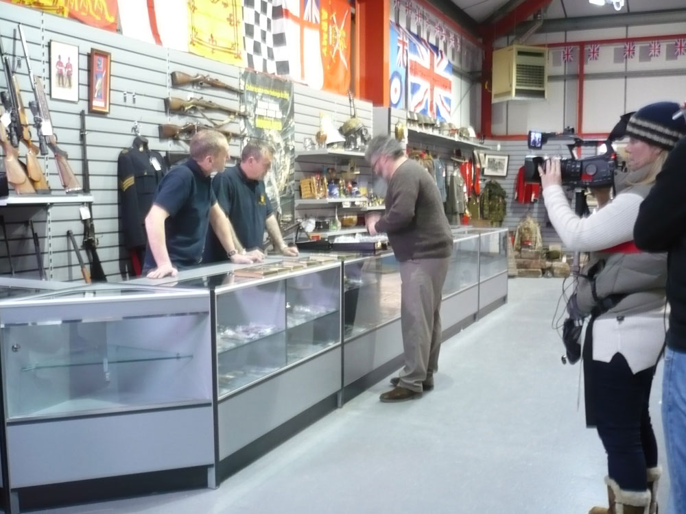

# TOLKIEN INSPIRED ART

*[image — role: featured | alt: People at gun shop counter being filmed | source: https://festivalartandbooks.com/wp-content/uploads/2020/05/Shooting-pt-2.jpg]*

We have completely phased out fantasy art from our peak in 2015 when we represented 13 Tolkien inspired artist.  The decision was taken mostly to focus on book dealing, but other factors like the rise of digital art and that the popular films had a lasting influence on new artist interpretations of Middle-earth. Neither have been good for originality. We now only deal in art/posters related to the early promotions of the books or original art used in books, which is now extremely rare and valuable.

There are many famous fantasy artists who were inspired by Professor Tolkien’s books, particularly The Lord of the Rings trilogy. By the late 1960’s The Lord of the Rings had become a worldwide phenomenon, especially in America amongst University students. Although Professor Tolkien was an artist and illustrated the Hobbit, The Lord of the Rings only had illustrations on the dust jackets. This would open the door for official and unofficial Tolkien inspired fantasy art. We focus on Tolkien and Middle-earth inspired art we stock originals, and prints. Extremely rare, promotional posters for book releases, book illustrations and other officially commissioned Middle-earth art and maps which is now highly collectible.

In the early days, the copyright holders were not as vigilant in enforcing unofficial art and use of Tolkien’s name or fictional characters. Various unofficial prints and posters were produced, amateur and professional. We find it particularly interesting to see their interpretation of what Middle-earth and its characters look like before the Peter Jackson films. Some early artists felt Middle-earth was not earth, but another planet or a parallel world. Most others stick with a medieval, renaissance era world with a slight fantastical flare. The debate continues; did the Balrog have wings? Since the Peter Jackson films from the early 2000s, the works of Alan Lee and John Howe, the film’s concept artists, have dominated our perception of Tolkien inspired art. We collect and sell the early artist interpretations, pre-2000, but on occasion sell the newer ones too.
