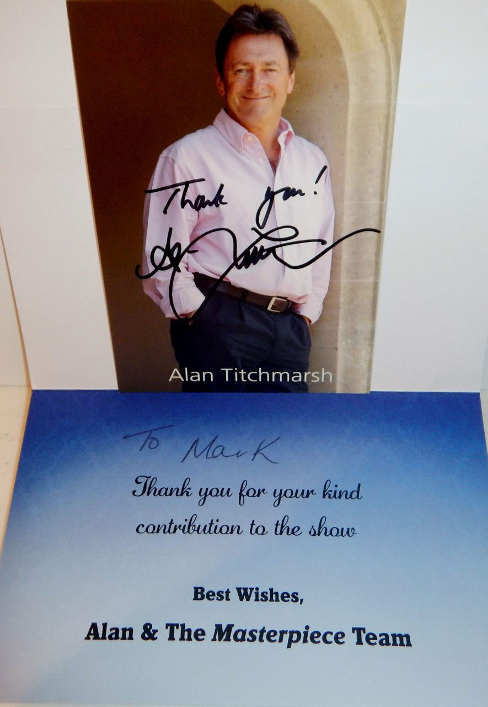

# TV APPEARANCES

*[image — role: featured | alt: People at gun shop counter being filmed | source: https://festivalartandbooks.com/wp-content/uploads/2020/05/Shooting-pt-2.jpg]*

Mark Faith promoting Tolkien Rare Book collecting on T.V.

As a new cycle of the Tolkien film and events begins, we plan to do T.V. and other media.  We stopped before because most producers do not pay participants for their time and expenses.  If you are a producer willing to pay for expert’s time, please contact us.

You can find links to past activity on our You Tube channel.

https://www.youtube.com/c/MarkFaithD52

Four Rooms – Mark Faith of Festival Art and Books tries to sell the first ten printings of The Hobbit by JRR Tolkien, June 1st, 2014. For copyright reasons you may not be able to view the links for this series.

Mark Faith, founder of Festival Art and Books and Festival in the Shire, as you might have gathered by now, is a prolific collector of rare Tolkien first edition books and posters. He is also an expert on collecting Tolkien merchandise and has recently showcased his knowledge of the subject on a number of television programmes including Channel 4’s hugely popular television show Four Rooms which offers sellers of valuable and collectable items a chance to pitch their items to four of the UK’s biggest dealers. Up to 30 dealers are rotated throughout the series to give the viewers variety. They range from the art collector and academic Ruth Meakin to the interior designer and A-list dealer Celia Sawyer. Mark did not accept any offers for his Lord of the Rings first editions when he appeared on the show but recently sold the set for £15,000.

He has also made two appearances on the new U.K. version of the Pawn Stars show being aired on the History Channel. The U.S. version has been running since 2009 and is the second most viewed show in North America with over 5 million viewers. Pawn Stars is a reality T.V. show is based in a pawn shop and depicts the bargaining over the items customers bring in as well as discussing their historical background. The Show has received great critical acclaim. DVD Town praised the show for its cast and the educational value of the items displayed, calling it “addictive” and a “Big time winner”. In 2010 Rick Harrison was named pawnbroker of the year due to the fact that Pawn Stars raised awareness and bettered the reputation of the industry. Pawn Stars is also very popular among the viewing public, which is why the show has been aired in over 20 countries including Belgium and Turkey.
Rodney Matthews and Mark Faith appeared on the show on September 9th, 2013, and Mark appeared again on September 23rd to showcase his rare complete set of the first ten Hobbit impressions alongside Charlie Chaplin’s original tramp suit and the first Manchester United football programme after the Munich air crash:
“…the boys meet a seller looking to part with ten first editions of the J.R.R. Tolkien classic, The Hobbit. The seller’s asking big money for his books, but does the price ring true for this precious literary classic?”

Pawn Stars – Mark Faith of Festival Art and Books tries to sell Rodney Matthews pencil sketches used for the book Alice’s Adventures in Wonderland. Also features an appearance by Rodney Matthews.

Four Rooms – Mark Faith of Festival Art and Books tries to sell the first issues of the Lord of the Rings set by JRR Tolkien

Pawn Stars – Mark Faith of Festival Art and Books tries to sell the first ten printings of The Hobbit.

First Edition Hobbit appears on ITV’s Masterpiece programme
Masterpiece With Alan Titchmarsh Thursday 18 Feb
Episode 4 – Teams try to uncover the most rare and valuable pieces at Kentwell Hall in Suffolk.

*[image — source: https://festivalartandbooks.com/wp-content/uploads/2020/05/Thank-you-fort-use-of-Hobbit-1st.jpg]*

For more information please contact Mark Faith by email
MarkFaith@festivalartandbooks.com

---

## Links found on this page

- [https://www.youtube.com/c/MarkFaithD52](https://www.youtube.com/c/MarkFaithD52)
- [MarkFaith@festivalartandbooks.com](mailto:MarkFaith@festivalartandbooks.com)
