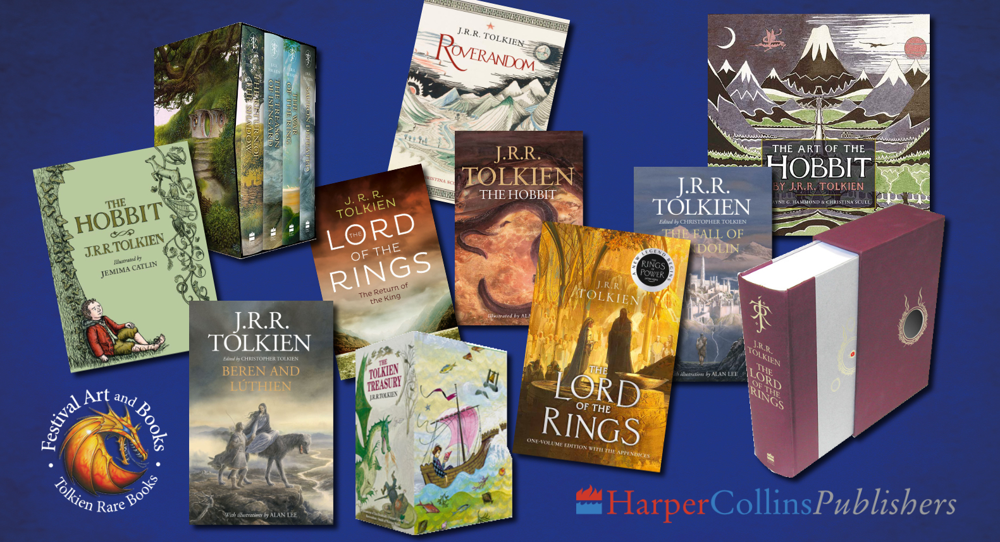

# USED TOLKIEN BOOKS, Q&A

*[image — role: featured | alt: Collection of J.R.R. Tolkien books | source: https://festivalartandbooks.com/wp-content/uploads/2024/06/New-books-montage-1.jpg]*

Questions and Answers on Tolkien Rare and Collectable Books.

By Mark Faith

Introduction

My Tolkien Collector’s Guide provides general advice on selecting and buying used and rare Tolkien books and memorabilia. Collecting strategies for Tolkien titles, and specifically what to buy, can change with the market. If you are thinking of buying a book costing thousands, it is best to contact us directly for expert advice. With new films and other related developments in the works, the Tolkien fan market is about to take off, just as it did 25 years ago when Peter Jackson’s films came out. The huge boom in popularity back then took fans and experts by complete surprise. The market is still growing, and people are much more aware of it. I set out in business around 2001 to make Tolkien book collecting easier and more accessible to everyone. Photographs replaced detailed descriptions, often riddled with old book binding terminology that no longer applies. Millions use eBay, which provides instant availability, a wide selection from all over the world, and a range of prices. My only criticism is the need for better book categories which they once had.

First editions are now so rare, in good condition, that they are too expensive for most collectors. This was true before too, but today we know they are worth the investment, so there is more demand. Oddly, you do not hear of record sale prices of The Hobbit and The Lord of the Rings on the internet as these are perhaps irrelevant to the average collector. It may be a consequence of AI. We know that upward price trends and new price highs are particularly important for removing perceived value ceilings.

eBay is not the only a source of books but a critical provider of real-time information on the Tolkien rare book market. On the downside, you do have to spend many hours on the internet to keep up. My regular customers let me do it for them. Only the best of the best is available in my shop. That is one of the reasons why I provide information and newsletter updates for our fans and customers. Subscribe today.

Digital information is in flux now due to emerging technology. Search engines were producing accurate results, but the new AI is notoriously inaccurate. Not only is accuracy a huge problem, but we also seem to have lost valuable information. I recently spoke to an expert consultant S.E.O. who explained why this is happening. His view was that every country has its own version of popular search engines. For your website to show up in a search in a specific country, the search engine must be configured for that market with the appropriate regional keywords, language, and technical settings. Content must be written specifically for that region’s language, the audience and its preferences. The digital world is now made up of many digital regions reflecting features and trends specific to those regions. If you do not live in a particular region, you may not even see a search result from it. This is partly because there is now too much information on the internet. The biggest search engine now prioritises what is nearest to you geographically, not key words. This is a very important fact. You may be the only seller of certain items in the entire world, but an algorithm may not recognise your specialty, seniority, or expertise. It will not track who has been the leading expert the longest or who holds the rarest or biggest inventory. What a search engine algorithm is actually measuring is indications of popularity, things like the number of other social media sites linked to yours, how often your site is visited, or how much relevant content exists on your pages.  What counts is how well your site is structured to be read by a computer rather than by humans. In short, search engines and AI may perceive someone to be an authority who is nothing of the sort.

Information on the internet is not necessarily factual or even expert opinion. Just because everyone says it is so, does not make it so. It is not clear exactly how AI will resolve this. With that in mind, let me offer some frequently asked questions on Tolkien, and their answers, based on thirty plus years as Tolkien collector and dealer.

Questions & Answers

What is the value of a first edition, first printing of The Hobbit and The Lord of the Rings, complete with dust jacket?

A: At auction in TX recently, May 2026, a first edition Hobbit sold for $450,000 and The Lord of the Rings for $325,000. Prior record sale prices by auction were $300,000 in 2024, and $250,000 in 2025 (for a signed copy, signed on a page). For some reason, such sales are not being reported on Tolkien related websites. Why is there so much missing information or misinformation, as well as fake news and clickbait? Media sites, even reputable ones, want you to click through to raise their profiles on search engines and so will only present information they deem to be popular, even if incomplete or false. This is a disgraceful situation as millions of people are making decisions based on such misinformation.

Is this what these books are officially worth?

A: There is no official price, only what someone will pay. Auctions reflect the value on the day of sale which can be inflated by emotional factors and not necessarily be consistent with current market trends. In a high demand market, those with means will pay whatever it takes. New price highs break through the perceived ceiling of value, in turn raising all prices down the scale. I have sold Hobbits for between £150,000 to £300,000 and Lord of the Rings sets for £50,000 to £125,000. Our exact prices and customers remain confidential.

What is the record price for an unsigned 1st/1st Hobbit, without a dust jacket?

A: £40,000 at a UK. auction. Most of the value is in having a complete book with a nice original dust jacket, unrestored. A record price for a jacketless book sets a precedent for all other rare Tolkien books without dust jackets. However jacketless books or those with severely damaged jackets will not appreciate as fast until all copies with dust jackets go into collections and never come out. Like new price highs, emerging developments lead to new trends.

What is the difference between a restored and a repaired dust jacket? Is a restored one worth less?

A: Nearly every first edition dust jacket we have seen without visible damage has been repaired or touched up, namely as conservation repair, which is a good thing! It is impossible to know how many exist without any repair whatsoever. The original paper was cheap with some early editions printed on recycled paper which damages easily. Collector acceptability is a question of the extent of repair and is usually less than 3-5% of the jacket area depending on where the repair is made. Restoration, on the other hand, is when large sections of the jacket are torn or lost, and the paper is replaced and hand-painted to match. Professionally done, these restorations are very hard to detect, and many sellers don’t even mention it because many don’t know. My view is that a restored dust jacket is still worth what it was before it was restored; the restoration adds nothing to value. Most collectors of means are purists and would not buy a restored copy. In the art and museum world many old items have had restoration, some quite extensively, but their value is usually intrinsic to their importance to history and culture, not to their physical attributes. The intention is not to increase value artificially. Early printed books by J.R.R. Tolkien are now becoming culturally and historically important.

Are new or recent editions worth collecting?

A)Yes, but mainly for enjoyment, not real investment. Generally, those published before 1990 have become very rare in nice condition as so many collectors are chasing them. They are appreciating in value at a faster rate than 1st/1st editions in some cases as these have a smaller market due to high prices.

Tolkien was not as popular early on as people think. People did not look after their books or their jackets with future value in mind. By the late 1960s collectors realised they would have future value and started to take very good care of them.  Some newer deluxe editions since 2000 had limited, numbered, or even signed print runs and are therefore truly scarce. Identifying a first edition, however, is impossible as print lines do not necessarily reflect their printing sequence anymore. Their components are produced all over the world and then assembled wherever the distributor is located.  Brand new books must stay as new and, ideally, still in the shrink-wrapped packaging to have any chance of gaining value.

Are older damaged editions of The Hobbit and Lord of the Rings worth anything?

A: If the book is complete and in good condition and the dust jacket has only say 10% loss, tears, or damage, then perhaps so. Damage tends to be on the jacket spine as this is exposed to aging, handling and the environment. Stains, marks and fading on light coloured paper also affect the value.  What constitutes acceptable damage is partly personal preference. The older printings are scarcer because the print runs were small, but the wear, damage and aging may be worse. Some collectors prefer good aesthetics over age so would rather have a later printing in better condition. There is a point where the two preferences combine to give an average value, but that also depends on what is available on the market at any given time. You will not find a fine early copy in a charity shop or grandmother’s attic anymore, except by amazing good luck.

What order should I collect in, and what should I buy first?

A: This is a very difficult question. The market is about to boom due to new films being released. You should buy everything you can afford as the prices are rising and the average condition of available books is declining. Collectors are selling off their dregs and unwanted copies after they upgrade, which creates a different supply chain dynamic than normal market attrition.

What is a first edition?

A: It is the first printing of the first text version available to the public. Older Tolkien first editions are easy to identify. They show only one copyright date, and later printings are declared, even on the dust jacket. J.R.R. Tolkien books have never been out of print and there have been many hundreds of new editions and illustrators. First printings of new editions are referred to as ‘first thus’, first edition of that version or that publisher. Before a certain date, a number 1 in the ten-digit number line denoted a first edition. This varied by publisher.  By 2,000, number lines had become meaningless because of digital printing on demand; they can reprint a 2nd or 10th printing before the first printing is even off the press.

What is a state?

A: This term gets misused, even by experts. A state is an intentional variation of an edition by the publisher. This can be a reprint to address errors. Misprints, ‘typos’ and mechanical printing errors are not States. They are fun to collect but are no more valuable than any other copy. In Tolkien there are few official states except those with added illustrations, etc. The slip text 4 in Return of the King is NOT a state, its a printing error.  State was once important and originated in the antiquarian book world, helping to determine the very first version or first edition. Even different States can still be true first editions. Many older books were privately printed. Those for sale to the general public were called trade editions printed after the first edition and usually clearly dated. As certain books become more valuable, misprints and states are often used by dealers to command higher prices.  It also appeals to collectors to own the rare State, but it does not necessarily have additional value.

Do price clipping, owner names, inscriptions or bookplates affect value?

A: No. This depends on personal preference and is not a problem in modern collecting, though once used to drive up the value of a book. Some collectors will avoid them, but they are normal features of used books. It is abnormal damage that effects value. The condition and the printing matters most. Older Tolkien books are usually well read and cheaply printed, so nearly all have flaws, especially the dust jackets which were not designed to last but served as advertisements.  Price-clipping was usually done by the bookstore to designate discounted copies approved by the publisher, which affected royalties.

Are there Tolkien experts or official Tolkien sources?

A: Professor J.R.R. Tolkien’s written works are considered to be important English literature for our age. Academics study his work as such and as many of them have higher degrees, they are considered experts. You can now study for an English literature degree in Tolkien. Over the decades, however, thousands of fans without qualifications have made a study of the man and his work for their whole lives. They have an encyclopaedic knowledge of Tolkien lore, as it is known. They too are experts even if not recognised as such. Many have written excellent books and speak at fan events and society meetings.

The original publishers, Allen & Unwin, did not keep records on production and distribution. All paper records of the day were destroyed due to storage space limitations. Some old printing information exists, apparently, but this doesn’t give detail on distribution or the exact intentions of the publisher.  Even major bookstores might have made changes to copies they sold.

I have made a 25-year study of buying, selling and collecting Tolkien books, as a Tolkien rare book expert, and it has been an honour.  I have made accurate predictions of values in the past, even on T.V., when many people thought I was mad. They now wish they had bought one or two from me! I have sold some of the most valuable examples and thousands of copies of the other older titles. I have seen tens of thousands of examples on the internet and in person. There are many excellent established general dealers with expert knowledge of rare books, but they do not specialise in Tolkien alone as I do, or for as long as I have. Many dealers and sellers are only now jumping on the Tolkien rare book bandwagon.

These questions and many more are covered in detail in my Tolkien Collector’s Guide. For a free copy and to subscribe to our newsletter, contact  markfaith@festivalartandbooks.com

---

## Links found on this page

- [markfaith@festivalartandbooks.com](mailto:markfaith@festivalartandbooks.com)
