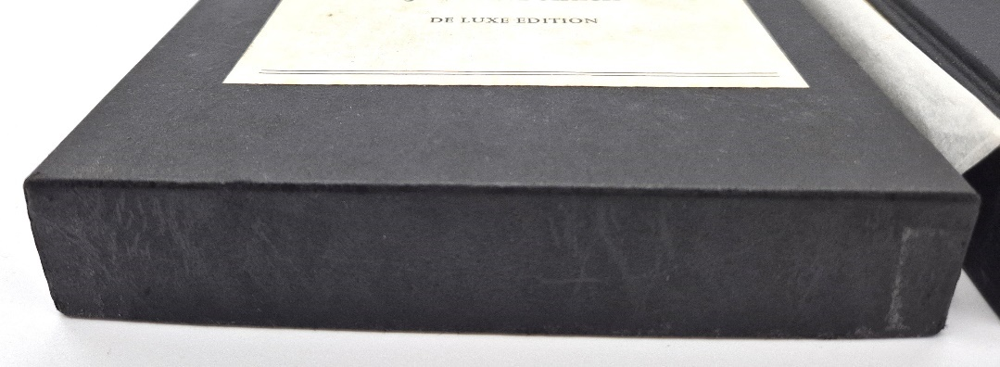

**Modern Tolkien collecting needs far less antiquarian jargon than dealers sometimes suggest: printing numbers, impression charts and copyright pages identify editions, but condition and market knowledge matter more than states, issues or misprints.** This chapter covers how printing technology changed, what Lord of the Rings impression records reveal, and when proofs are genuinely collectable.

## How did book printing change?

In the 17th and 18th centuries book publishers were also printers. Publishing was a high-risk business, it was expensive, and the printing and binding of books was a highly skilled craft. Only small quantities of books could be printed and bound due the prohibitive costs and the skills required. Printing runs were in the hundreds or low thousands.

Printing technology did not really advance exponentially until the 1950s with the offset press, but the low-cost waterless offset lithography changed the publishing/printing world forever in the 1960’s. It was now cheaper and easier for publishers to contract out book production to specialty printers who could now print books in large quantities, and far cheaper for multiple publishers. It became mass book manufacturing, with hardbacks and the newly popular, paperbacks.

Later, computer digital printing, though more expensive, saved money in editing and layout as well as allowing much smaller print runs, reducing the marketing risks. Modern books are now cheaply glued together, though their dust jackets are much flashier. A print run could be increased part way through as a sudden increase in sales demanded; it was print on demand.

The number line in the front of a book tells you the printing, but it is common that first, second or third print runs were all made before the first was even distributed to the public as extra orders came in from distributors. The printing number adds little to the value of very modern books which often needs to be in fine condition and signed to have any collector value at all due to large cheap print runs.

The antiquarian book market is all about very old printing methods and technology, not just old books, where states and variations determine the first edition, thus the value. It is sometimes a detective story and does require more specialist knowledge from the dealer than do modern books. The Victorians thought cloth books were ugly, bought just the sheets (pages) and had them custom bound in leather to match their private library styles. This meant identifying first printings later came down to mistakes in printing process or what other pages were bound, not the bindings or the covers. When your leather binding got worn or torn, you had it rebound again. If the back wore out (spine) then one had it re-backed. This “restoration” has re-appeared in modern times; however, the motive is now profit, not preservation.

Whole books are devoted to antiquarian book manufacturing and use many technical terms with which many modern dealers like to overwhelm the amateur collector. Mostly they have little or nothing to do with modern printing or even collector values. All trades like to guard their knowledge, but thanks to the internet people can learn all they really need to know of a particular modern author in a matter of weeks or even days. It is sad to we bibliophiles (or book lovers) that we seem to have lost the art and craft of book making/binding. I love the smell and feel of old books. In fact, oddly, I can tell a lot about a book by its smell!

There exist on-line groups of Tolkien fans fixated on printing and printer details, oblivious to the fact that the real publishing data were originally with Allen & Unwin, and long lost before Tolkien even became a phenomenon. I happen to know this first hand. The current publisher Harper Collins has a detailed record of modern editions thanks to computers. There are, however, still a few aspects of old book technology and terms relevant to modern collecting and we will delve into a few of them.

Since most popular book collecting today is concerned with modern fiction, antiquated printing and binding techniques no longer apply; the antiquarian dealer has had to become the rare modern book dealer, requiring much less specialist knowledge. Older Tolkien book fans worked hard in the early days to bring Tolkien and fantasy into the mainstream of book collecting, establishing the genre as important literature in its own right. Tolkien himself struggled to have his works recognised as important literature, especially in academic circles. In the new Letters of Tolkien, he reveals how much of his time was spent in his publishing world chasing more sales and new books. The academic world in which he made his living was being neglected. Literature fans and their clubs, and academics in the 1970s do deserve the credit for elevating Professor Tolkien’s works into mainstream popular literature. However, it was the American liberal, counterculture hippie who first put Tolkien on the world map.

1965/66 was a turning point for Tolkien book copyright due to issues in America when Ace published their own set of Lord of the Rings paperbacks. There was a rush to register new editions of both The Hobbit and The Lord of the Rings to protect the copyright in the USA. The copyright page in paperbacks and hardbacks in all countries had to reflect the change. Today, copyright pages are printed separately; sometimes the wrong one is bound in or they intentionally use an old one. Different publishers would eventually have their own copyright page versions, but it is possible for the odd copy to have an odd page variant. The publishing records, not printers’ records, would reflect this. My research and observations indicate that the 1967 Unwin paperback version used a new cover; Death of Smaug from Tolkien’s own art. It has variations making it difficult to identify certain rare printings. This also applies particularly to Hobbits.

## What is the Lord of the Rings printing history?

Professor Tolkien’s now world famous literary masterpiece “The Lord of the Rings” (LotR) was the long awaited sequel to “The Hobbit”, released in 1937. It originally consisted of five books but was reduced to three to lower printing costs and make it more affordable. The war caused a considerable delay and the author’s search for perfection in his writing exacerbated this. Even after the 1954 release of “The Fellowship of the Rings” (FotR) he continued to make text changes in the next fifteen first edition printings and on into the second printing of the second edition at which point he was more or less satisfied.

“Two Towers” (TT) and “The Return of the King” (RotK) were subject to the same printings and revisions, twelve and eleven impressions respectively. Hardback books were very expensive in the 1950s, so publishers limited print quantities until they knew the previous print run had sold out. The three books were not sold as a set initially because of the cost. Customers bought them as they were released or as they could afford to. New books were printed as the old ones sold, which gave Tolkien the opportunity to make text changes and corrections for each print run. At the same time the “Hobbit” printings were being amended so that the stories and characters aligned. There are some records of sizes of print runs and the books themselves have their print history recording year and impression on the copyright page. Accuracy influenced the amount of royalties paid.

From information printed in the books, I compiled a chart (below) of the printing history for each title. It is tempting to group them by impressions/printings or by year but there was a gap of fourteen months between the first FotR and first RotK with reprints of the first two titles also being released. What the printing records reveal is the date and quantity of allocations to bookstores. One can assume distribution must have been close to the print date, but what isn’t clear is how many of each individual title the bookstores were sent and how many they already stocked. The books and dust jackets look the same, and many were sold as seconds (discounted remainders).

*Printing history chart compiled from information printed in the books: allocations to bookstores, not distribution records.*

If you walked into a bookstore between July 1954 and say July 1956, it would have been impossible to know the dates and printings of any set in stock. We can only speculate on the probability of availability based on original print quantities. Contrary to popular belief, the hardbacks were NOT best sellers. Bookstores almost certainly had leftover stocks of books and dust jackets. Three book sets were sold in slipcases in limited numbers: three hundred initially, increasing to five hundred by the 1960s. These sets were comprised of books which varied in terms of date and could have been changed by the bookstore owners combining older printings with newer ones to make their own sets.

## States, issues and misprints

A lot of collectors make a big deal of “states” and “issues”. An “issue” variation happens during a print run while a “state” is a new reprint with a variation. In modern books, these are interesting, worth collecting, but not worth more than the same books without them. Modern collectors often confuse printing errors with states or issues. It may be interesting and fun to collect all the variants, but only a collector’s personal preference makes one edition more valuable than another. The first impression of The Lord of the Rings Return of the King has three states or versions; one of these has a slip text on page 49 being numbered as 4 (slip texts are printing errors where the paper slipped in the press). These, however, are not really states and not that important to the set’s value unless all three are collected. They are unique but only valuable in the sense that they help us to identify the first and early printings.

I once had a potential buyer tell me the first state of The Return of the King was the only true edition; wrong! Boy did he miss out on a lovely set.

## Proofs and advance reading copies

Advance reading copies and proofs are different things. Proofs were for text review and revision, usually by the publisher’s own proofreaders. Advanced reading copies were sent to distributors and media editors for review, feedback, and promotion, but the text is already fixed, indeed it was usually the actual bound book. These were more for marketing purposes. I sold one proof of the 3rd printing of Fellowship of the Ring. It was interesting to see the text changes and editing, especially those made by Tolkien himself. Proofs are therefore part of early publishing history therefore valuable. Advance reading copies, unless sent to an interesting party, are just another copy of the book with only a little extra value.
