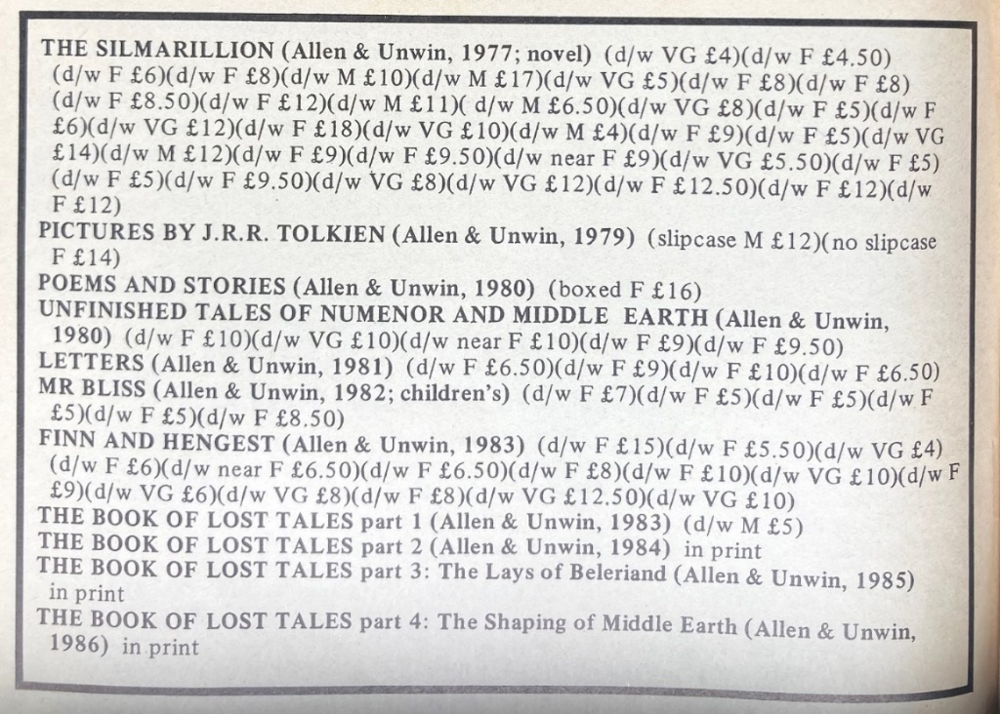
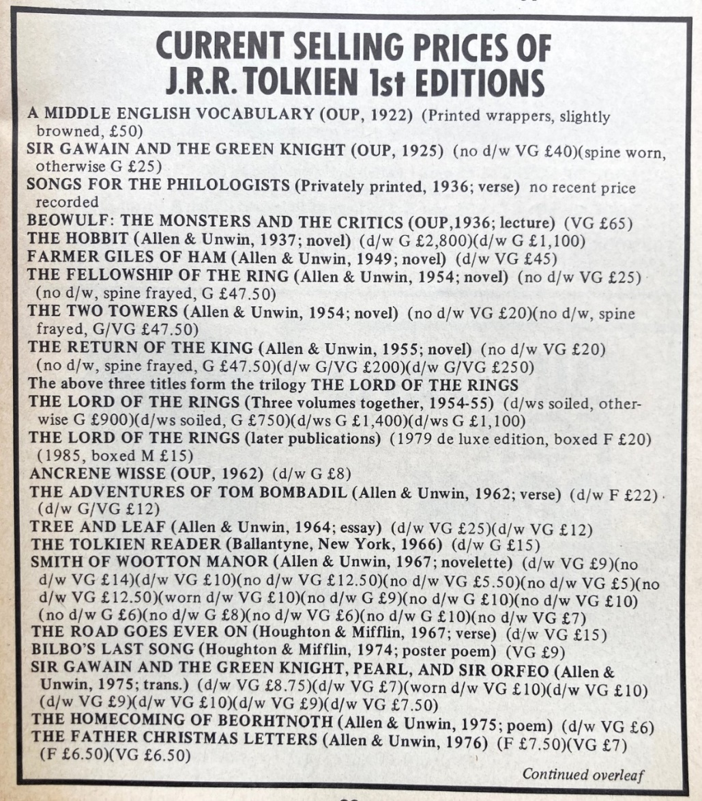

**Tolkien collecting spans three main eras, 1960s paperback discovery, the 1970s–2000 collector boom, and the post-Jackson internet age, and only early small print runs, fine condition and honest deluxe slipcases tend to hold real long-term value.** Modern mass printing and global assembly have made edition points less meaningful than whether a copy was preserved from new.

## What are the three eras?

Those editions and printings prior to the year 2000 might be termed first and second eras of Tolkien book collecting. We are now in the third era: post Peter Jackson films. We might very well be entering a fourth era. The first era started in the mid-1960s with the discovery of The Hobbit and The Lord of the Rings as cheaper paperbacks by the hippies in America. The second era was the mid-1970s to 2000 where we see many new illustrators, different bindings, printings, languages and deluxe editions which catered specifically to the growing Tolkien book collector market. Then, like now, certain deluxe editions were in smaller print runs with better quality printing and as the name implies, were much more expensive. By the 1980s Tolkien fans were buying copies to collect, not to read, so many examples were found new, once read or unread, but only for a short while. These finer, older copies would become the new standard against which keen collectors compared their finds.

The third era saw even more new releases, variations in illustrators, bindings, styles and languages. At the same time, the internet was becoming more popular, and all used books could be found much more easily and traded by the public directly, not just through book dealers. There were much larger print runs of newly released books running into the tens of thousands. Newly released deluxe editions seemed more a commercial gimmick and I overlooked them in favour of increasingly valuable older editions and printings. I was aware that the attrition in older Tolkien books was due to their poor manufacturing quality. The deluxe editions were much more expensive because of the quality and because they catered to serious collectors. This third era also saw the release of more new books thanks to Tolkien’s son Christopher.

Like every other major industry, publishing has gone global. Harper Collins is now the second largest publisher in the world. As a group, they sell 120 million books a year from over 10,000 titles. They acquired Houghton Mifflin (U.S. Tolkien Publisher) amongst others and have over 150 imprints. Harper Collins UK is still the main literary agent for J.R.R. Tolkien’s estate.

Every major publisher now has their own definition of what is a first edition within their own product lines. This has changed over the years so may be different on older titles. ISBN is the standard for copyright but doesn’t identify first editions or first printings in modern books. With Tolkien books, unlike those of new authors, there are so many editions, printings, bindings. imprints etc. as to become meaningless and unimportant.

A first edition is the first version of a particular text to reach the market and in the case of Tolkien, the true first editions are the U.K. English language editions. International editions all feature U.S. spelling and grammar. First printing as defined by the number line is the first print run, but not necessary the first to reach the market. 2, 3 or even 15 or 30 can be part of the first lot of books printed and sent to bookstores, especially with best sellers. Finding a number 1 in the number line today wouldn’t mean anything in a large print run. The production of books is now computerised. Publishers can decide to print more or even make minor corrections to the text before the book even leaves the printer’s. You can have copyright page dates and print dates in the same binding that don’t match. That is because they are assembled in the UK, but the different components are printed overseas, usually China. Moreover, when 120 million books a year are printed quickly and cheaply, the number of misprints and faults are in the millions. They are sold as “seconds”, just like new clothes that don’t quite fit. As many as 40% are misprints. The perfect stock goes to big chain stores, the seconds to the second-hand stores or on-line wholesalers. Wholesalers sell them cheaply on sites like Amazon or eBay. Unsold newly printed books from new authors also suffer this fate. The royalties paid to the author are based on the selling price. These seconds are sold without shrink wrap or boxes. In the good old days, seconds were identified by clipping the dust jacket. Astonishing as it now seems, many late 1950’s printed The Lord of the Rings first editions were sold as seconds in clearance sales, unwanted in the major bookstores at the time. Bookstores like supermarkets, need space for new products which might sell better.

## What about deluxe and slipcased editions?

The black slip cased deluxe first editions on india paper from the 1970s (1969 is the earliest) and 80s are some of our most often collected Tolkien books. New deluxe editions are gaining popularity, although first printings no longer fetch a premium. With older deluxe editions it is not just first printings that are collected, but subsequent re-prints. I have always stocked multiple copies as I sell so many, but we only list one at a time. We are now listing copies in various conditions. Not so long ago they could be found mostly in fine condition, often unread, with only minor wear to the slipcases. The original cases are as important to the value as a dust jackets are to other books. Without cases, they have little collector value but are fun to collect anyway. As the books are protected by the slipcases and are found in mostly fine condition, variations in value now depend on the condition of the case. This now varies widely as more come on the market due to increased demand. Where our prices might have reflected slight variations between cases, finer cases in original condition are now worth much more than those in average or damaged condition. In fact, the case dictates the price as the books are generally fine. The usual condition issues apply such as chips and marks, and especially the condition of the label which suffers damage through handling; clean and white with original colour is required.

Given that modern books are produced in such large numbers and are poorly manufactured, most will have no future value. The sheer number of editions, variations, styles and now languages of Tolkien books encourage collecting. Add a few exciting misprints and you can spend hours, days, even years finding every possible variation; but will you have a collection of any value?

First and older editions of Tolkien books had much smaller print runs, usually 1,500 to 4,500 copies compared to 15,000 to 30,000 copies today. Older editions are bound to be rare and because they were around before people started collecting and preserving them, many were lost to attrition with damage and loss, particularly to dust jackets, which weren’t considered important then. The remaining copies worthy of collecting number in the hundreds. Books were better preserved in the second era when collectors bought them to collect, not to read. In the post Jackson film era, only brand new and shrink-wrapped copies have any future value. Unopened copies demonstrate that they were new from the publisher, not “seconds”. Today’s deluxe editions have much smaller print runs of 6,000 or less, so have a good chance of appreciating in value if collector numbers stay the same or increase. As far as modern editions are concerned, deluxe versions have the most potential followed by first edition hardbacks. On that basis I see no end to Tolkien book collecting.

## Why does Tolkien endure?

What makes Tolkien so timeless and popular through the generations? Is it that he tapped into our innate romanticism? Perhaps, given the complexities of modern life, we yearn for a vision of a simpler life with simpler rules. Tolkien’s genius wasn’t in the intricacy of his stories, but in his ability to present tales with a clarity which made them universally understood. It may have taken a while for the book world to realise, but Tolkien is here to stay. Tolkien’s works are indeed the literary highlight of the 20th century, but unless you believe this you will not pay $300,000 for a 1st/1st Hobbit.

## Closing advice

Unless beginners’ mistakes are made, collecting Tolkien’s books it is an enjoyable hobby. Although there are only a handful of titles, there are hundreds of editions and printings that range from £10 to £100,000 or even more; something for every budget. Most are easy to identify, and the prices generally reflect what you are going to get for your money.

While there was, in the not-so-distant past, the rare possibility of a Tolkien treasure being found in grandmother’s attic or a charity shop, this doesn’t happen much anymore. The public are aware that early editions are valuable and do not give them away without doing a bit of research first. You do have to take the time to teach yourself the very basics, which is part of the pleasure of collecting. Dealers will help to a degree if you are buying from them, but they are busy and cannot be called on to answer every little question you might be able to research yourself. I publish on my website some guides, and you can subscribe to my free collector’s newsletter. Where you really need the advice of a specialist dealer is when spending thousands on a book.

Again, the main lesson to learn is that condition is everything in Tolkien books, as with all modern collectable books for that matter. The older the printing and closer to the first printing, the more valuable a book will be. With any printing, however, a book must be complete with the dust jacket and have no damage other than that caused by normal wear and tear. Generally, they must be printed by the original publisher and not be a cheap book club edition. The same book of the same printing can be worth £50 or £5,000, depending upon condition. There are plenty of worn books about; it’s the fine ones that are truly rare. Every day someone says that they have a particular old edition, but then I learn that it is damaged, missing its jacket, or the jacket is severely damaged. Sadly, it’s likely to be worthless, while the same book complete and in near fine condition is very valuable. As time goes on, however, even poor copies can rise in value as the top end of the scale becomes out of the reach of the collector of limited means.

Should you commission a specialist Tolkien dealer to sell your book, you will be paying them for their access to their market and using their reputation to support the price they are asking. Even at the lower end of the market, people call me all the time and ask me the retail value of certain books. I might say, for example, roughly £500, but later they’ll tell me they could not sell it for that. That may be because only a specialist with a good reputation has credibility when setting a price. Similarly, if you buy from a specialist, you will generally get what you pay for, though not necessarily a bargain. If there is a problem later, you have some recourse with a professional. Finding something of real value that you can get at a bargain price is a near impossibility, but it can happen, with a lot of luck. If you do find a good one, buy it while you can!

*All copyright 2024–26, Festival Art and Books & Mark D. Faith.*
