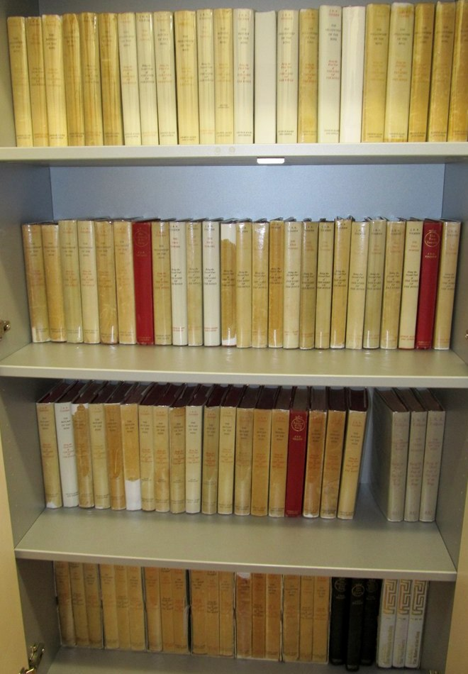
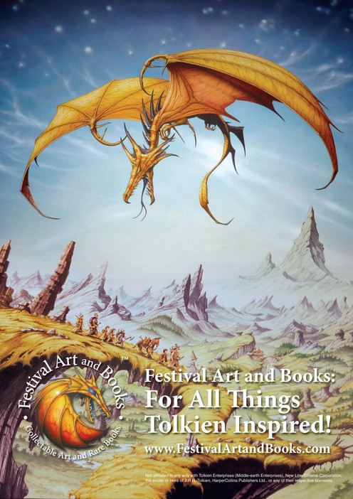
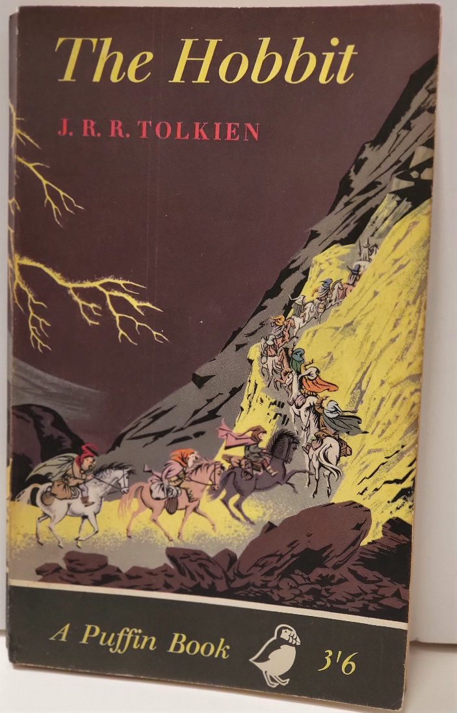
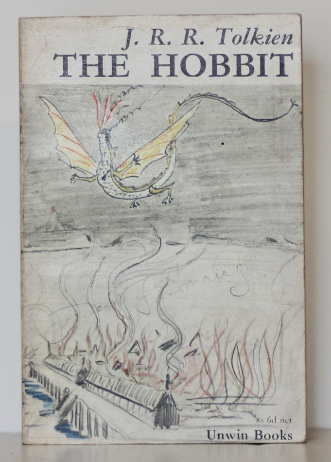
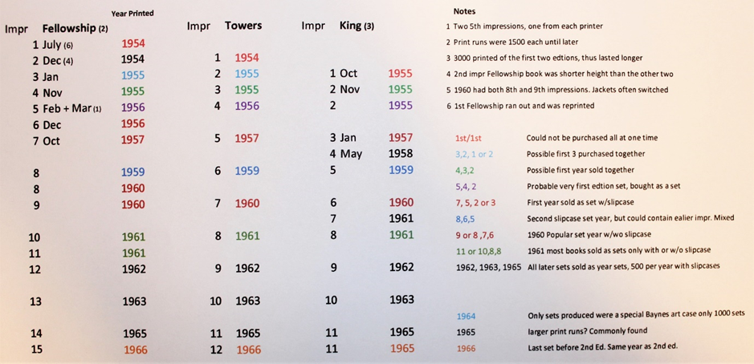

**When choosing what Tolkien books to buy, prioritise the earliest printing you can afford in the best possible condition, complete with its dust jacket, and buy from a specialist who has handled thousands of copies.** Condition influences value more than edition points or jargon. The Hobbit and The Lord of the Rings remain the core of almost every collection, but signed books, uniform wear on sets, and honest photographs matter as much as the printing itself.

## Why does specialist dealer experience matter?

When I started the business in 2001 there were four specialist Tolkien dealers. Two have since retired with another coming and going. Over the last ten years the development of online book selling has produced many new dealers, including a few promoting Tolkien books, but these also sell many other authors’ work too. I think special expertise in the work of a single author is important. Tolkien is even more popular thanks to all the films, and I notice that a lot of booksellers use Tolkien books as a loss leader in their online advertisements. If you visit their websites, you will find that they have very few books. Excepting the four specialist dealers mentioned earlier, few have my experience, especially of rarer, higher value books. What is required is not knowledge of books in general, but knowing which is the better of two or more copies and knowledge of what is likely to appear on the market. I have sold thousands of Tolkien books and have seen many thousands more in the process. There is simply no substitute for this experience.

Tolkien first editions are not difficult to identify as most of the publishing data are clearly indicated in each book. Many dealers and even Tolkien fan clubs make it sound more complicated than it really is. The use of jargon makes the vendor seem knowledgeable in order to promote sales and raise prices. Condition has the most influence on value, especially that of the dust jacket. Modern editions from 1990 onwards are glued together, not sewn. The materials are harder wearing and the colours don’t fade as much. However, after having been read a few times, they may begin to fall apart. Newer editions are therefore most valuable unread or read just once. A book by another famous author I once specialised in deteriorated just while sitting on a shelf; the glue dried out and the pages became loose.

## How does condition affect scarcity and value?

As an author’s work becomes more collectable, people look after their books better. This results in less wear and tear so that many copies remain in near fine condition. It is the demand for the books that creates the scarcity, not just the printing. In older Tolkien books the damage attrition was much greater, more wear and loss of copies creating scarcity. He was not famous at the time and people didn’t think to collect the books or look after them. It shocks me to see cup rings on books and jackets, books having been used as drink coasters. The greatest damage is from damp especially in Britain where until relatively recently, people didn’t have central heating. This rainy climate and damp housing has ruined more Tolkien books than any other factor.

*Most dust-jacket wear appears on the spine, exposed to air, handling and damp.*

## What titles and editions should you collect?

Tolkien collecting is mainly focused on two Books: ‘The Hobbit’ and ‘The Lord of the Rings’. These titles, even their later editions and printings, are the core of any collection. There’s a handful of other fiction titles which are becoming scarcer and rising at a faster rate than even the two main titles. As they started so low, they have the furthest to go. However, people collect the titles they like to read, and Tolkien’s other fiction books are of less interest. His non-fiction academic books are a very specialist area. There isn’t as big a market, so they too aren’t going to be in such high demand. Books about Tolkien except the first biography aren’t collectable. eBay needs to change its categories as they clog up the important fiction listings.

Some editions are obviously scarcer than others with some variations of those editions being even more collectable. For example, American editions are, strictly speaking, reprints unlike their U.K. counterparts. However, there’s a nostalgic aspect to book collecting and people start with the editions they first read when they were younger, American and British. Editions produced before 1965 are very rare and the closer you get to the first printing the more prohibitive the price for the average person. From late 1960s to the 1990s print runs got larger and larger. There are therefore plenty around, but not always in fine condition. Books and film memorabilia produced after the Peter Jackson films have produced many new film fan collectors, but it will take decades for these newer items to become truly valuable. It depends on how many new fans come along, with new films coming again it seems the franchise is not ending. The exception is new deluxe editions which are better made. So many are printed, however, that it is hard to imagine them being scarce in the future. ISBNs, reset editions and number lines do not apply to rare book collecting, only to editions less than 30 years old. ‘Edition’ no longer matters. This is something I knew but didn’t know that I knew. It has to do with registration of the printing of books and copyright of the content. In later publications the same ISBN can be used for a different version of the book with a new cover, binding etc. Sheets or pages can be reset into a new binding. This happens when books are paired in a slipcase set, etc.

Number lines, 1-10, on the copyright page, do indicate the printing. Where there is a ‘1’, it is the first printing. Everything now being done digitally, editing of the text, layout etc., means that errors can be corrected during the printing of the first edition. A second or third print run can be performed at the same time as the first if demand exceeds expectations. I have walked into bookstores selling supposedly newly released books to find the lowest number in the number line to be a 2 or 3. Since condition matters most with modern books (they must be ‘as new’) the edition no longer matters. As most modern books are printed in such large numbers, I doubt they will become rare or valuable. If they are signed however, that’s different.

As regards Book Club and Folio Society editions, the chances are these won’t be worth much because so many were printed, and the binding quality is so low that they won’t stay in fine condition. Certain very early such editions are increasing in value, but they must be in fine condition. The modern ones I see look cheaply printed and frankly, quite ugly. I don’t see them rising in value much. The first editions/first printings of early paperbacks are valuable if in true fine condition. Eventually later paperback editions will be collectable, but not the reprints. I do, however, know collectors who collect everything Tolkien; it’s a compulsion. The more of them there are, the more everything Tolkien will appreciate in value.

The History of Middle-Earth set of twelve books is not as popular in terms of content as Tolkien's other books being hard going reference material. It comprises Tolkien’s academic references for middle-earth, painstakingly compiled from his notes by his son Christopher after his death. Those setting out to complete a full collection must buy the set in fine condition. The publishers were inconsistent, so it is difficult to identify the first printing of each volume. Book of Lost Tales 1 & 2 and Silmarillion should be added to make a fifteen-volume reference set. What isn't widely known is there were fewer printings of the last three titles of The History of Middle-Earth so these are harder to find when completing a twelve book set. You often see books one to nine for sale, but ten to twelve are always sold as part of a complete collection. As far as future value goes, because they aren't as popular to read, they might not appreciate as much, but remain collectable for dedicated fans.

Many sites catalogue non-fiction Tolkien books and books about Tolkien with his fiction books. The list of fiction books is quite short, aside from the main two, there are Farmer Giles of Ham, Smith of Wooton Major, Tom Bombadil and Tree and Leaf. The latter are collections of poems. All are part of what Tolkien described as ‘faery stories’. His earliest published work was the poem, Goblin Feet. There are also works his son Christopher Tolkien produced based on his father’s notes on middle-earth, as aforementioned. His non-fiction works were academic. The money he later made from his masterpieces meant he did not have to publish academic works any longer. The Silmarillion is perhaps the most well-known book that was published after Tolkien’s death. These and the later editions of all his earlier books, from different publishers in different languages and with different illustrators, number in the hundreds. Except for deluxe editions, they all had large print runs, so time will tell what will remain collectible and rise in value in the future. Already, his early fiction books in first edition have all but disappeared. Most collectors start with the two main books, then, as financial means improve, they go back to collect early editions which are rising in value much faster. In the more than 20 years that I have been a dealer my revenue has climbed more from rising values than rising numbers of customers. Early editions in finer condition are now out of reach financially for most people which has led to desperation in terms of the quality of what is selling now. My advice is to collect the earliest published editions in the best condition you can afford. These are the rarest and will be increasingly hard to find.

## What about signed books and associations?

Recently we have seen signed and unsigned Tolkien books which claim an association with Professor Tolkien. This is a tricky business as far as value and collecting are concerned. A signed and inscribed book is valuable if it can be proven genuine, but it is exponentially more valuable if the association is known and substantiated. It is worth paying extra, a lot extra, if there is provenance with the item and if the association was close. That Tolkien went to a dinner with, and signed a copy for a relative stranger does not make it special. Also, a close association may not make it special either unless supported by letter exchanges revealing it as such. The Letters of Tolkien is a good reference source for such associations.

It is said that 50% of signed Tolkien books are fakes, but which 50% are they?

Tolkien had his signature printed in some early paperbacks attesting to the fact that they were authorised editions. That meant that his signature was known and could be forged. As time goes on and signed books become more valuable, so more fakes will be produced. Some are so good that it is unlikely that one could tell the difference without expert knowledge. I have sold many signed books and letters. I consider myself one of the world’s experts, but I will not explain how you can tell a fake from a real one, for obvious reasons. I do give a certificate of authentication with every signed item. Those with provenance and associations are three times more valuable. My advice is only to buy signed items from specialist Tolkien dealers, but this does not include auction houses which do not have experts on every famous person’s signature. I have sold many hand-written letters which gives me experience with his writing.

## Do bookplates and owner inscriptions matter?

Some people dislike owners’ signatures and bookplates. This is a carryover from the antiquarian book world. My professional opinion is that small bookplates don’t affect the value as overall condition matters most. Bookplates and signatures do no harm and there’s a certain charm to a hand-signed, beloved book as many passionate collectors will agree! Offered two identical books I’d prefer the one without bookplates but better still one that has an owner’s signature, especially if it is in all three books of the ‘Lord of the Rings’ set for example. This gives an important clue as to when they were bought. Different signatures in each volume of a set means that they were bought separately and not kept together as a set. The most important feature of any set of first editions is that the dust jackets’ wear and aging matches, indicating that it has been together from the outset. The 1960s sets were sold as such each year so the combination of impressions of constituent volumes is consistent. Up to that point a greater variety of impressions were used depending upon availability. There was consistency only in the few sets earmarked for sale in slipcases. Uniform wear and aging are the only clue that a set purporting to be from the 1950’s was not compiled later. On balance, early Tolkien books are so rare now that none of this matters much in their case. In rare instances there are large and long descriptions on the blank end papers or sometimes multiple inscriptions from multiple owners; these can affect the value, but again relative to overall condition.

*Uniform wear and aging across all three jackets suggest a set kept together.*

## Why are early dust jackets so fragile?

The early edition hardbacks and their jackets were cheaply printed. Despite this, they were very expensive in their day. The first Lord of the Rings mid-1950s cost about two months’ salary to the average working person. Only until printing became cheaper in the 1960s were they more accessible. The dust jackets of older books were only there to advertise other books from the publishers and to protect the cloth covers. ‘The Hobbit’ in particular seems to suffer the most attrition, probably because it was a children’s book. They perhaps decided it wasn’t worth spending money on quality if children would just ruin them. This is one of the main reasons the first/early editions are so rare. Of the original thousands printed, only hundreds exist today in collectable condition. This is leading to the restoration of dust jackets.

Over time I’ve observed that certain once common editions are now rare and that certain editions are more popular than others and thus harder to find. If I mis-judged and missed an opportunity over the last decade, it was not buying more of the second, third and fourth editions of Tom Bombadil, Farmer Giles of Ham and Tree and Leaf while I still could. Percentage wise, they have soared in price more than any other Tolkien title the last 3 years. Consequently, later printings are started to rise in value as 1st/1st editions are all gone.

## How should you judge condition and price?

Knowing the effect of condition on price is more an art than a science. It pays to think of condition in terms of the likelihood of finding a better copy coming along. The beginner’s mistake is to delay, missing out on the best copies in the hope that better ones will come along. Another beginner’s mistake is buying on price alone. If you are going to be serious about rare book collecting, the rule is you get what you pay for. A cheap and worn collection will not appreciate. Nearly all collectibles, or indeed any asset will have a future value built into the current price, based on market anticipation of price movement. This is an important concept. The property market is a good example of this. This means that the buyer must have an expectation of what that future value might be before they decide what they’ll pay. Things may not be worth the asking price but rather what people will actually pay. There’s a speculative element in any market that many people seem to get right more than they get it wrong. What makes you a good predictor of the future is the ability to read minute market indicators and make connections that others miss. An eye for detail is important, and this improves with time and experience. Predicting the future value over time, short and long term, is a collecting skill. If you don’t have it, then buy from the more experienced sellers. Don’t be cheap!

Before the internet it was very difficult to become a specialist in the rare book world, it took years of exposure and the building of a reputation. Their business is a supply business, having a supply before others or when no others have the same books. General book dealers with shops must make a profit every month to stay in business. The effect of overheads on profit is reflected in the price of every book they sell. If their business is down, you might get a bargain. However, this can also mean they are not as diligent in the description of condition. Unless you can inspect the book in person, there’s always a risk in buying online from a non-specialist. Sales feedback as we know it now is meaningless, but a reputation as a specialist dealer of long standing speaks volumes. If a general dealer sells a lemon, they lose a customer; if a specialist in only one author or genre gets it wrong, they damage their business. Word gets around. The longer a specialist is in business, the more likely they will continue to get it right. Making the quick buck ceases to be an option as you become more specialised.

Seeing the actual book was critical before the advent of the internet. Today, study of the sellers’ photographs will tell you almost everything you need to know, especially if you use a large computer screen with high resolution, rather than a mobile phone. Note that colours and shading vary between display screens, but you should be able to see the main flaws. Knowing where to look is the key. As I said earlier dealers’ detailed descriptions are often only there to impress you, to give you the impression that a book is worth what they are asking. Most old book manufacturing terms don’t apply to modern printed books. Ask for more photos if you can’t see the whole book jacket especially the spine of the dust jacket. You can become a flaw detective, predicting that a flaw is just off the edge of the photo for example.

Damage to modern books, less than forty years old, is most common on the dust jacket and book spine. The colours on the dust jacket’s spine can be faded or the paper torn and tattered at the top and tail from being pulled off the shelf. The covers are almost always fine having been protected on the shelf, even from environmental damage like damp and mould. If a seller has posted poor photographs that don’t show the commonly affected areas, chances are you are wasting your time. Somebody who has done a little research, even a private seller, will know what their book is worth and provide good photographs. Damaged books, ex-library books, and those without jackets, even ‘Lord of the Rings’ volumes, are worthless. Regarding the latter, yes, there will come a time when books without jackets will have value, but from a future investment point of view, not yet. Sometimes ex-library books have decent jackets without marks but look carefully.

Books that have suffered damage from age and regular reading are to be regarded differently to those having suffered abuse and neglect. Average read condition is my baseline with any defects beyond that being detrimental to value. Experienced collectors and even novices expect to see age-related defects but not the results of neglect and mistreatment. Naturally, they expect newer editions to be flawless but want their attention drawn to extraordinary wear or damage by descriptions and photographs. Failure to point out an obvious flaw only wastes everybody’s time. It is inconsiderate. I was the first to show dust jackets laid flat in my photographs so that buyers could see the entire jacket’s condition. I conceal nothing. If I don’t show it, there’s nothing to see. You can see the marks, tears and fading to the spine and lack of fading to the flaps as well as the extent of paper loss. I would go as far to say that some sellers go out of their way to hide damage in the composition of their photographs, even some dealers. Why is this? It only leads to returns and the loss of a new customer’s trust. Call me old school but wasting customers’ time shows a lack of respect for them and their business. Some mega-companies are going to learn this the hard way.

## Restoration versus repair

There is a difference between dust jacket restoration and dust jacket repair. Museums define repair as something that could be removed without damaging the original state. Repair is generally for preservation and conservation, to prevent minor damage from getting worse. For example, acid free clear tape over a paper tear is fine as it prevents it from tearing more. Restoration rebuilds what is severely damaged or missing and can’t be removed later without causing more damage. The main difference is motive. The damaged item has a value as it is. The restoration has a value. The two together, however, do not make the item worth what it would be in original, undamaged condition. Unacknowledged restoration is deception, fakery, and the motive are only profit. I am shocked to see major auction houses selling restored items but not disclosing this fact. Some say that if only a small percentage, perhaps 5%, has been restored, it is acceptable. I say not necessarily. Most restoration is likely to be to the jacket spine ends or corners, to make it look like new. If the vendor isn’t charging for fine, then perhaps that is acceptable. No one wants to see the damage get worse on a truly fine set, so some conservation repair is good.

To me, restorations says more about the buyer, than the seller. Sellers want to make money. If the buyer is happy collecting a fake, it is more about whether they look good, not the quality of the item they collect. Some can live with a fake, others cannot. Someday partly restored jackets will be common and fully acceptable, but for now, buy unrestored copies. Minor repairs are fine. Authentic collectors prefer them warts and all.

Archival paper repair tape is almost invisible and is acid free. Importantly, it can be removed (using the above) and no trace remains on the original condition, thus making it a repair, not restoration. This is so important where paper has begun to tear to stop it from getting worse: a stitch in time saves nine. Acid free glues are also available for carrying out safe repairs. Where a book binding is loose, usually from the paste down starting to come loose, you can carefully lay down some glue between the paper and cloth cover to tighten it up again. Importantly, this will stop the gutter from tearing! Gutter being where the pastedown paper meets bound pages on the blank end pages. Modern books have two parts, the cardboard/cloth covers and the pages which are sewn/glued as a packet. These two are attached together using a paper paste down. If heavily stained from the effects of mould, or torn, the pastedowns can be replaced and the book rebound, if you can match the paper. However, this is now entering the realm of restoration. In newer books, ask to see photos of the end pages and the spine of the dust jacket.

As with their school books, some people put plastic and even brown paper over original dust jackets to protect the jackets and the book. It is a great idea as such dust jackets have obviously benefited, especially the original colours, which don’t fade as much. However, tape adhesive contains acid which eventually stains the paper even after the tape has been removed. This is generally on the flaps or the pastedowns (inside covers) of the book. A professional can bleach such stains on dust jackets if not too deep but generally they penetrate and can be seen from both sides. Sometimes the stain is just on the reverse of the flaps and can’t be seen. As early jackets become scarcer, such damage will become more acceptable. This does not apply to laminated dust jackets where the protection can’t be removed. These I am afraid are worthless.

If people can be shown honestly what they are buying, they can make an informed decision. The informed customer is the best customer. You will not find time-wasting descriptions or lengthy terms and conditions in my listings or business terms. Where I see such meticulous terms and conditions I automatically assume that this seller sells rubbish and gets lots of returns. This matters of course not just with expensive purchases, but with every purchase. Oddly, honesty keeps people coming back; what a concept.

## Is collecting about profit or passion?

Most new collectors start small and build up. I suppose this is to see if they really enjoy collecting. Others recognise that certain early titles are going to be investments and start at a higher level but subsequently go back to collecting the less expensive editions. There’s a finite amount of ‘spend’ as a new collector because you have not quite developed your sense of future value potential which becomes more real the more passionate about collecting you become. Collecting anything is not logical, it is emotional. I’m not sure the human as an animal is a natural collector. Certainly, many don’t get it, and so don’t collect. We have all seen T.V. shows on collecting where someone finds out that a worthless looking thing is worth thousands. I think this is more like gambling then collecting but value going up is part of collecting otherwise we wouldn’t do it for very long.

Collecting books is generally about liking literature and a particular author. It is also about a hobby and enjoyment, not always about profit. Tolkien books with hundreds, even thousands of editions and printings can become an obsession when combined with a passion for the author. Are the early and first printings really worth the money some people pay? Where is the cut-off point? Logic kicks in when you come to realise that Tolkien books are an investment which can be very lucrative. You develop an investor’s viewpoint, especially if you must explain it to a partner. Of course, those who started years ago have an advantage, but my customers who started later are making more money as prices become crazy. All markets are subject to peaks and troughs with periods of bubbles (inflated prices). In Tolkien this has become part of the film cycle. I think you must take the view that you are in it for the long run but take the gain when it feels right, or when you need it.

## What about Tolkien art?

*Book and Magazine Collector December 1988 No. 57*

Of course, Tolkien art is also collectable. By 2014 I was an agent for most of the Tolkien-inspired artists selling originals and prints. I also sourced original fantasy and science fiction art used by poster companies like Athena, and art used on book covers. Most of the well-known Tolkien art is in a museum I helped to found. I no longer deal in art (long story). There are two types of Tolkien art: that which was authorised and used in books and posters, now extremely rare and all but gone, and Tolkien-inspired art by established and emerging artists. This mostly means art inspired by the books and lately the Peter Jackson films. Thus Tolkien-inspired art can be divided into what came before the 2001 films, and what came after, copying the art concepts used in the films.

Art before the films relied on the artist’s imagination and interpretation of Tolkien’s written masterpieces. Professor Tolkien himself was an amateur artist and of course had his own vision of middle-earth. He was mostly concerned with sub-creation, what his readers pictured and imagined in their minds as they read the books. He personally approved of just one artist in the main: Pauline Baynes. The now iconic art of the 1965 first paperbacks by Barbara Remmington was not to his liking, but later when it made him famous, his opinion changed. I look out for art and prints produced in the 1960s and later, which is pure interpretation of the texts. I can recommend artists who accept commissions.

*A Baynes cover*
