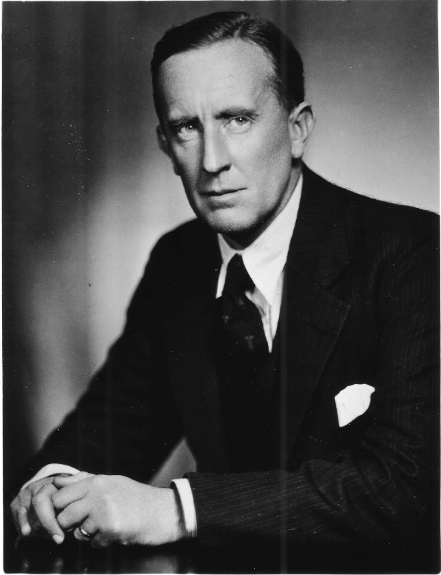

**The safest place to buy rare Tolkien books is from an experienced specialist dealer with stock in hand and a reputation to protect — not at auction and not on price alone.** Building a long-term relationship, negotiating with courtesy, and understanding how the market behaves like a commodity futures market will save you from overpaying for poor condition or restored jackets.

## Why build a relationship with a dealer?

As a dealer and businessman, future stock value is twenty years away for me, but I do need turnover to buy more stock. My consignment business advising people when to sell is about timing and individual client needs. Some will sell collections to pay for their children’s education; others will leave their collections in their legacy. What creates a shortage is books going into collections and not reappearing for decades. This could mean that at some point, when future generations no longer like Tolkien books or films, thousands of books will flood the market causing values to plummet. Alternatively, like some other classic books, Tolkien’s works may continue to reach new highs, particularly when in fine condition. I am passionate about the core literature so believe collecting will continue long after I’m gone. It is hard to convince others who have never read the books or don’t enjoy them that this is the case. That is human nature. We like what we like.

Developing a relationship with a regular dealer is worthwhile. I do business with people, not computers. That way you learn more and get better deals over time. I honestly prefer dealing with regular old customers than chasing after new deals. It is perhaps my age, but younger people often do business differently. They are less trusting, less informed, more demanding, and frankly often rude. Their attitude is that their business is more valuable than everyone else’s. Okay, if you are looking at one of my books at £50,000, you are going to be wined and dined by me. You can certainly expect me to be polite, do as I promise and make doing business as easy as possible, without wasting your time or mine.

## How should you negotiate?

One area of difference I have noticed between generations is the ability to negotiate. Frankly, the young are poor at it perhaps because they buy everything online without contact with a real person. Sending me a blunt message without ever having dealt before such as “what is your best price?” is not going to get you my best price or not even a discount. A polite email or phone call will get you something, be complimentary and you might get a huge discount. Its only human. If I think you are going to keep buying from me, your discounts will get bigger in time. Buying in quantity will get you a bigger discount. I do business with people I like and won’t do business with people I don’t. I can and do discriminate as I do sell very rare books. Negotiating is about building a rapport to achieve a better price or favourable terms, but you must be sincere and ready to keep your promises. Never break a promise to buy or do something. This might seem cheeky saying such things, but trust me, it works with sellers I deal with.

## Are auctions a reliable guide to value?

An old adage is that something is only worth what buyers are willing to pay, but that doesn’t demonstrate true value; the next item could sell for more or less. Auctions are helpful with unique pieces like art works, perhaps, or antiques as far as establishing a baseline value goes, but many of the same books can become available with a huge variation in prices. Auctions profit from excitement, emotion and sentiment. If someone feels that, in the heat of the moment at auction, they must have something, they may pay way over the odds. If no one else bids, they may get a bargain. Sales platforms or bookdealers’ prices give a better idea of trends and values in real time. Rare Book Hub publishes the results of book auctions around America. These are useful for understanding whether book markets are picking up or slowing down. The percentage of items selling at a price exceeding the minimum bid is particularly instructive.

While the auctions do have specialisms, few are any good at indicating Tolkien values which can vary widely. The other thing auctions can’t provide, which is vital to value, is an accurate description of condition. A few years ago, the two major houses in London sold Tolkien books with restored dust jackets for very high prices. In my opinion, they were worthless. Restored jackets aren’t worth more than they would be in their original condition. You only have to follow other collector markets like those for classic cars or stamps to learn the value difference between original and, frankly, the faked.

It is exceedingly difficult to assess whether a recent price achieved for book at auction is indicative of trend or an exception. Buying at auction is risky both in terms of condition and price. Auctions can be high-profile or provincial. It is possible that a one-off, truly rare copy might have come up, key factors being condition, the general economic climate, and finally whether two keen dealers or collectors bid each other up to a ridiculous price. Book auctions are still mostly for book dealers and antique trade professionals as they know more about what to look for and the price they are likely get when reselling. Even dealers prefer to deal with known fellow dealers because they know what to expect.

General dealers and auctions houses claim to have rare book expertise, but how can any general dealer really have expert knowledge of every author and their market? On any given day, I can tell you the value of any Tolkien book you might show me. It’s an art, not a science.

## How does the Tolkien market behave like a commodity market?

In another lifetime, I traded commodity futures contracts. That inspired me to think about investments and speculation in rare books in the same way as the book market, thanks to the internet, behaves like a commodity market. Yes, you are just buying books, but it’s all about their future value and how the market behaves given the fundamental principles of supply and demand. When few are available books are always priced at the perceived future value, not necessarily current value. More common editions are so readily available that you pay the current price, knowing that they are unlikely to appreciate much in the future. When a particular book is continually available, the buying and selling cycle is much shorter, perhaps just weeks or months. When a book is very rare that cycle could take years. You must have a time frame in mind.

A little more about commodity market, one of the oldest forms. A modern feature of it is the commodity futures contract, a promise to buy or sell in the future, like a stock option, at an agreed price, usually about a year later. In commodities futures you are not buying based on the actual supply and demand forecast, but the speculative outlook. You are gambling that the price will rise (or fall - more complicated) in the future. Speculative commodity futures contracts have an influence on the actual commodity price throughout the year. The commodity price is affected by what is happening in the real world: drought, flood, political uncertainty etc. A trend toward oversupply or undersupply can be perceived at a certain point. There are no future contracts in books, but the bookseller and buyers share the mindset of that world.

The volume of trading also affects perceived value; people copy each other. This brings more speculators whose trading activity moves the market more than external events. If there’s a lot of activity in both real and speculative markets, you get volatile prices in short bursts. If there’s little activity, fewer books come on the market and choice is limited. Prior to the internet, the rare book market was a purely physical market, usually local to a city, region or country. The internet brought us real-time supply, demand, and price data, from all over the world which requires a very similar set of analytical skills for book trading to those required for stocks or other traditional investments.

The Tolkien market has become much more speculative than ‘real’, a market for traders rather than true fans. This has upset some fan societies. Like me a fair number of collectors spotted the opportunity to buy and sell to upgrade their own collections and became part-time book dealers in the process. Most have funded their own collecting. I started with many genres, but with a world-wide market, I was able to focus on only one author of just a handful of titles and make a full-time business of it. To be a successful trader I must study and understand the market every day, all day. I must be prepared to act every day to take advantage of the volatility of supply. It is therefore easier to get what you pay for by buying from an experienced Tolkien dealer than it is by becoming one.

Smart people know that your money must work for you and are more willing to try new markets, even risky ones, when traditional markets aren’t performing. The stock market in recent years has returned as much as it has gained. Investors are waiting for new trends; consequently, there’s an astonishing amount of cash sitting around right now looking for new markets. I recently read that there is nearly $9 trillion in America, and £2 trillion in the U.K. Only a tiny percentage would have to go into the rare book market, including the Tolkien market, to change it completely and bring prices up to new levels. Its already happening. In 2019 I sold three Hobbit 1st/1st for £50,000- £70,000 each: record prices. All the buyers were investors, including one from Asia.

## What does the bell curve teach collectors?

*Compare every copy you can find side by side — fewer fine examples remain on the market as the best go into collections.*

Understanding book market fundamentals is to understand distribution and probability statistics. I was never a brilliant student in any subject, too impatient to think hard about anything and more than a little dyslexic. I had a mandatory semester on statistics that filled me with dread. The first day the teacher gave workgroups of three a huge pile of a hundred acorns and told us to sort them by category. What categories? we asked. They look the same. As they appear compared to one another was the answer. They were green and brown, large and small, shiny and dull, round or misshapen and so on. The assignment was to determine the main features of the average acorn in the sample and sort them into categories based on these. The more we sorted, the more we found that certain characteristics, some natural, some not, were common to many acorns, a simple majority, while some features were indeed rare. 90% were very similar in a range of attributes, while 5% were uniquely perfect while the last 5% were the dregs of the acorn world.

Of the similar acorns, most fell within one or two increments of the rest while a smaller number within three to four. When the numbers are plotted on a graph, you get a bell curve (normal distribution), the top centre where most are similar is the mean.

There you have rare book collecting in a nutshell, or acorn shell. The point is that variations in condition of a sample of copies of a given book are normally distributed like the acorns. If I had a hundred books in front of me, I could easily sort the average condition from the dregs to the finest. You don't need to be a statistician.

I'm saying that the general elements of condition remain consistent over time, partly aging and wear, partly unnatural damage. As time passes there are more books in poorer than average condition because the best go into collections and the dregs go back on the market. What the collector tries to do is compare every sample he can find side by side (see photo) but there are fewer copies in any condition still available. I judge the condition of copies as they appear against the known distribution of categories of condition bearing in mind that fewer and fewer are coming onto the market in worse and worse condition. This is why prices go up; demand for better copies drives them up.

The few early first edition Tolkien books which come to the market are in ever poorer condition unless you are willing to spend real money. Tolkien books in fine condition are in demand and increasing affluence means that more people can now afford to indulge in the purchase of rare books. Buyers need to be realistic, however. If you thought Tolkien book prices were falling, would you even collect them? Does anyone collect worthless things? What would happen if prices for early Tolkien started to fall, or if it went out of fashion and everyone started selling books for far less than they paid? Would falling prices create new demand or would people question whether the bottom had fallen out of the market permanently? Those fans that always wanted an affordable 1st/1st Hobbit could suddenly buy one, but would they now? Any price would seem too high if prices were falling or trending down!

With enough experience, knowing when it was bought, you can predict the characteristics of an individual item, everything about it, without even seeing it. If someone tells me they bought a 1954 Allen and Unwin ‘Hobbit’ fifteen years ago, I can describe its probable condition. If the tell me they bought it last year, I can do the same. The same book published in the same year can be worth £5 or £500, £3000 or £30,000 based on the average variation in condition and the date when it was acquired. The earlier it was acquired and went into a collection, the less wear and tear it will have from circulation. After seeing hundreds and thousands of titles online and those that pass through your hands, you can become an expert simply by observation. The less experienced buy from me because I can assess a book’s true value and condition as well as the probability of another coming along. It is innate now, more an art than a science. For lifelong collectors of Tolkien or anything for that matter, this is part of the deep satisfaction, the hunt, not just the kill. As I recently told a Bitcoin investor, if collecting doesn’t excite you, well then buy Tolkien books as a speculator.

## Why collecting is more than money

To a book lover, nothing compares with finding a truly exciting example, either rare copy or rare condition. Collecting is about treasure hunting and of course that treasure has to have value. That can be sentimental value as well as monetary. I recently started reading the new version of The Letters of Tolkien where in one letter he writes about losing most members of his college poetry club to WWI. Imagine losing your closet friends from youth to the horrors of a pointless world war. There is no doubt that all Tolkien’s writing was an outlet for the pain of loss, not just superb story telling. There is a subtle humanity in Tolkien’s writing, unlike many modern works that try to be clever or gimmicky. That is why Tolkien’s works endure, and most fans have a beloved copy of one of his books they will always treasure. No, it is not all about the money.

## The charity shop story

There is also nothing more disappointing and deflating than to find out that the exciting example is not what it seemed. The thrill is the journey, learning and sometimes defeat, not just possession. A producer of a cable news channel called me to verify the value of a Lord of the Rings set. They were about to run a story on cable TV about a first edition found in charity shop worth £20,000. He thought to check it before broadcasting the film. I said it could be worth more than that but send me photos. What arrived were photos of books and jackets in tatters. Literally, the dust jackets were in pieces with sections missing as if a dog had it for breakfast. The books were equally beyond hope. Yes, it was an early printing set, but sadly totally worthless. I imagine they thought they found an old vintage automobile behind a barn that could be restored and worth thousands. Books do not work that way. After delivering the bad news (I could hear his grief over the phone) he now had to cancel the entire broadcast after hours of production. Broadcasting would have destroyed his and the charity’s reputation. I saved the day, and he thanked me profusely. What I did not tell him was that dozens of times I made similar mistakes when starting out, and that they still make me cringe.
