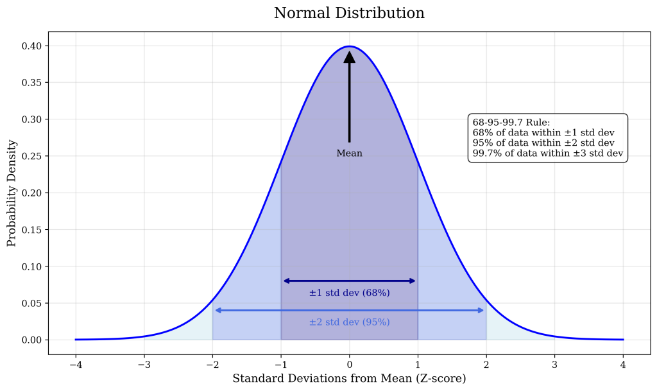

**A genuine 1937 Allen & Unwin first-edition, first-printing Hobbit (a 1st/1st) is identified by its copyright page and dust-jacket printing history, not by ISBN numbers or issue-point jargon, but condition and a complete original dust jacket matter far more than any bibliographic detail.** Older Tolkien first editions are easy to identify: they show only one copyright date, and later printings are declared, even on the dust jacket. The same printing can be worth £50 or £5,000 depending entirely on its state.

I have sold thousands of Tolkien books since 2001, and The Hobbit remains the book most people ask about first. Dealers and fan clubs often make identification sound more complicated than it really is. The publishing data are clearly indicated in each book. What actually separates a valuable copy from a worthless one is whether it survives complete, with its original dust jacket, in a condition a serious collector would want on a shelf.

## How do you identify a 1937 first edition / first printing?

A first edition is the first printing of the first text version available to the public. For The Hobbit, that means the 1937 George Allen & Unwin hardback, the British edition, which was released first and is considered the true first edition. American and other foreign editions are, strictly speaking, reprints of the U.K. text and are not as collectable, even though America eventually had a bigger readership.

Older books show the edition by year and by printing. A first edition, first printing is referred to as a 1st/1st; the next printing would be a 1st/2nd, and so on. On a 1937 Hobbit, look at the copyright page: the first impression should show a single copyright date of 1937 with no declaration of a later printing. Subsequent impressions declare themselves, on the book and, importantly, on the dust jacket as well. This is one of the reasons Tolkien first editions are straightforward to identify compared with antiquarian books where states and variations determine value.

The book must have been printed by the original publisher and not be a cheap book club edition. Book club and Folio Society copies were printed in large numbers with low binding quality and, unless very early and in fine condition, are unlikely to hold serious collector value.

Do not rely on ISBN numbers. They apply to the original registration of a particular publication, not necessarily the first edition of that book, and the same ISBN may be reused for variations like deluxe editions or changes of cover art. There are many variations of the 1966 Hobbit that use the same ISBN. ISBNs, reset editions and number lines do not apply to rare book collecting in the way many beginners assume.

## What publisher, binding and dust-jacket features should you look for?

The 1937 Hobbit was published by George Allen & Unwin in London. The early hardbacks and their jackets were cheaply printed; despite this, they were very expensive in their day. The dust jackets existed to advertise other books from the publisher and to protect the cloth covers, not to be preserved as collectables. That attitude, combined with the book's status as a children's title, is one of the main reasons first and early editions are so rare now.

*Most dust-jacket wear appears on the spine, exposed to air, handling and damp.*

Most dust-jacket wear is on the spine, which was exposed to the air. With less central heating in Britain then, common dampness led to mould that discoloured jacket paper, especially the spine, ranging from deep brown to white spotting to faded title colours. Damp also caused bleed from the cloth covers onto the back of the jackets and weakened the paper, leaving spines prone to fraying and loss. The rest of a jacket can still be very nice; the original colour, though, is grey, not beige or white, as you can tell from the grey flaps where the price and reviews appear.

Completeness of the jackets is critical to value. Think in terms of the percentage of paper loss, say 5% or 10%, usually at the spine ends from being pulled off a shelf. Whole missing sections reduce value significantly. Beware digitally printed facsimile jackets sold cheaply: they add no value whatsoever compared with a set lacking its jackets, and using one to overprice a jacket-less book is not just deception, it is theft.

When judging photographs, and you should study them on a large screen, not a phone, ask to see the entire jacket laid flat, especially the spine. I was the first to show dust jackets laid flat in my photographs so that buyers could see the entire jacket's condition. If a seller has not shown the commonly affected areas, chances are you are wasting your time.

## How do condition and market factors affect value?

Condition is everything in Tolkien books, and in all modern collectable books for that matter. The older the printing, and the closer it is to the first printing, the more valuable it will be. Any printing must, however, be complete with the dust jacket and have no damage beyond normal wear and tear.

There are plenty of worn Hobbits; it is the fine ones that are truly rare. Every day someone tells me they have a special old book, and then I learn it is damaged, missing its jacket, or the jacket is severely damaged. Sadly it is then likely to be worthless, while the same book complete and in near-fine condition would be very valuable.

In 2019 I sold three Hobbit 1st/1st copies for £50,000–£70,000 each, record prices at the time. All the buyers were investors, including one from Asia. That does not mean every 1st/1st is worth that much; it means the finest copies, complete with unrestored jackets, command prices that reflect how few survive. The same book published in the same year can be worth £5 or £500, £3,000 or £30,000 based on the variation in condition.

*Compare every copy you can find side by side; fewer fine examples remain on the market as the best go into collections.*

Supply and demand shift month by month. If there are no other similar copies for sale you will pay more; if there are plenty you will pay less. The long-term trend in Tolkien is steadily upward; I have never seen prices fall. It pays to buy from a specialist dealer with a reputation to protect rather than shopping on price alone or at auction, where condition descriptions are often inadequate and emotion can inflate a single sale.

There is a difference between dust jacket restoration and repair. Archival tape over a tear is acceptable conservation; rebuilding missing paper is restoration, and a restored jacket is worth what the item was before restoration, not what it would be in original condition. Unacknowledged restoration is deception.

## What does NOT matter for a 1937 Hobbit?

States, points and issues are variations, mostly intentional, and for some antiquarian books without copyright pages they can help identify true first printings. But for modern books like Tolkien's, first editions are clearly stated and easily identified, so variations are of interest to some buyers, and to sellers trying to inflate values.

Collecting more than one variation of the same printing is a waste of money. Condition matters most, not misprints, states and issues. There is a certain type of collector who attaches great significance to variations where none exists; avoid dealers who do the same, as it usually means they are overcharging you.

Owner signatures and small bookplates, in my professional opinion, do not affect value when overall condition is good. There is a certain charm to a hand-signed, beloved book, and many passionate collectors will agree. What matters is whether the copy was looked after, not whether a previous owner wrote their name inside.

Number lines with a '1' denoting first printings became standard on later Tolkien editions, but they are a feature of more recent publishing practice. For a 1937 Hobbit, the year-and-impression declarations on the copyright page and dust jacket are what you need; not an ISBN, not a ten-digit number line, and not dealer jargon about "states."

If you are spending thousands on a Hobbit, that is when you really need a specialist's advice. For everything else, educate yourself; it is part of the pleasure. Browse our [current Hobbit stock](/books), read the chapters below, and subscribe to our collector's newsletter.

## Further reading

- [What to Buy](/guides/collectors-guide-what-to-buy): choosing titles, judging condition and why The Hobbit suffers such high attrition
- [Where to Buy](/guides/collectors-guide-where-to-buy): specialist dealers, auctions and the bell-curve lesson on why fine copies keep rising
- [Technicalities](/guides/collectors-guide-technicalities): impressions, printing technology and what proofs are worth
- [Collecting Tolkien Books for Fun and Investment](/guides/collecting-tolkien-books-for-investment): the pillar overview on condition, supply and long-term value

*All copyright 2024–26, Festival Art and Books & Mark D. Faith.*
